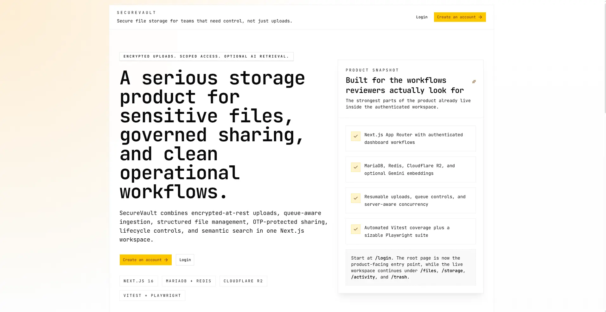

# SecureVault

[](https://nextjs.org/)
[](https://react.dev/)
[](https://www.typescriptlang.org/)
[](https://tailwindcss.com/)
[](https://orm.drizzle.team/)
[](https://mariadb.org/)
[](https://redis.io/)
[](https://www.cloudflare.com/developer-platform/products/r2/)
[](https://vitest.dev/)
[](https://playwright.dev/)

SecureVault is a secure file-storage application built with product depth, not just UI polish. It combines encrypted-at-rest uploads, resumable large-file handling, controlled sharing, lifecycle management, and optional semantic search in a single Next.js workspace.

For external reviewers, the central point is simple: this is not a toy upload form. SecureVault already implements the harder product and systems features that make storage software credible.

## Interface Preview



## Why This Repo Deserves Attention

- Encrypted-at-rest file handling with a layered key model instead of plain object storage uploads.
- Resumable chunked uploads with queue controls, retry handling, and server-aware concurrency limits.
- File and folder sharing with public and restricted links, OTP verification, download caps, and access logging.
- Operational lifecycle features including trash, restore, permanent delete, storage dashboards, and activity feeds.
- Optional semantic indexing for eligible PDFs and images, so AI search enhances the product instead of defining it.
- Real engineering surface area: documented architecture, Docker workflows, Vitest coverage, and a sizable Playwright suite.

## What SecureVault Can Do Today

| Area | Current capability |
| --- | --- |
| Authentication | Signup, login, secure session cookies, forgot-password OTP reset |
| File ingestion | Chunked uploads, resume flows, upload queue controls, encrypted storage in Cloudflare R2 |
| Workspace | File explorer, folders, search, preview, download, rename, move, bulk actions |
| Sharing | Public links, restricted links, email allowlists, OTP unlock, download limits, access logs |
| Lifecycle | Trash, restore, permanent delete, cleanup flows, storage visibility, activity timeline |
| AI search | Optional semantic indexing and semantic search for supported PDFs and images |

## What Makes It Interesting

SecureVault sits in a useful middle ground between a portfolio demo and a production-minded system design exercise.

- It is opinionated about security: encrypted at rest, scoped access, rate limiting, secure cookies, and hardened response headers.
- It is opinionated about product behavior: users can recover mistakes, share safely, audit access, and understand storage usage.
- It is opinionated about AI: semantic indexing is additive, gated, and non-blocking, so the storage product still works when AI is off.

Important scope note: SecureVault uses application-managed encryption at rest, not end-to-end encryption. Authorized server flows can decrypt files for preview, download, sharing, and indexing.

## Architecture At A Glance

SecureVault is implemented as a Next.js App Router application backed by MariaDB, Redis, Cloudflare R2, and an optional embeddings provider.

- `MariaDB` stores users, sessions, file metadata, sharing state, upload sessions, and indexing state.
- `Cloudflare R2` stores encrypted file chunks and related object assets.
- `Redis` supports rate limiting, upload-slot coordination, and optional queued indexing workflows.
- `Gemini` or a fake local provider can power semantic indexing when enabled.

The real product experience lives in the authenticated dashboard under `/files`, `/activity`, `/storage`, `/settings`, and `/trash`.


## Repository Layout

| Path | Purpose |
| --- | --- |
| [`secure-vault/`](secure-vault/) | Main Next.js application, API routes, schema, tests, Dockerfile |
| [`docs/`](docs/) | Handbook, API reference, Docker guide, Playwright coverage, engineering notes |
| [`resources/`](resources/) | Supporting references for security standards, external docs, and UI guidance |
| [`tasks/`](tasks/) | Phase-by-phase implementation breakdown |
| [`implementation_plan.md`](implementation_plan.md) | Broader architecture and delivery blueprint |

## Quick Start

The default local workflow runs the app on the host while MariaDB and Redis run through Docker Compose.

1. Install dependencies.

   ```powershell
   cd secure-vault
   npm install
   ```

2. Create `secure-vault/.env.local` from [`secure-vault/.env.example`](secure-vault/.env.example).

3. Set the minimum required values.

   ```env
   DATABASE_HOST=127.0.0.1
   DATABASE_PORT=3307
   DATABASE_NAME=SecureVault
   DATABASE_USER=securevault
   DATABASE_PASSWORD=securevault
   MASTER_ENCRYPTION_KEY=<64-char hex key>
   R2_ACCOUNT_ID=<r2-account-id>
   R2_ACCESS_KEY_ID=<r2-access-key>
   R2_SECRET_ACCESS_KEY=<r2-secret>
   R2_BUCKET_NAME=<r2-bucket>
   NEXT_PUBLIC_APP_URL=http://127.0.0.1:3000
   REDIS_URL=redis://127.0.0.1:6379
   SEMANTIC_INDEXING_ENABLED=true
   SEMANTIC_INDEXING_EXECUTION_MODE=inline
   SEMANTIC_INDEXING_PROVIDER=google
   GEMINI_API_KEY=<gemini-api-key>
   GEMINI_EMBEDDING_MODEL=gemini-embedding-2-preview
   ```

   Generate a master key with:

   ```powershell
   node -e "console.log(require('crypto').randomBytes(32).toString('hex'))"
   ```

4. Start MariaDB and Redis.

   ```powershell
   npm run dev:services
   ```

5. Apply the checked-in migrations.

   ```powershell
   npx drizzle-kit migrate
   ```

6. Start the app.

   ```powershell
   npm run dev
   ```

7. Open [http://127.0.0.1:3000/login](http://127.0.0.1:3000/login).

### Helpful Local Notes

- Real upload, preview, and download flows need valid `R2_*` credentials.
- For local runs without Redis-backed coordination, set `DISABLE_REDIS=true`.
- The documented local default keeps semantic indexing enabled with `SEMANTIC_INDEXING_EXECUTION_MODE=inline`.
- For local semantic indexing without an external Gemini key, use `SEMANTIC_INDEXING_PROVIDER=fake`.
- If `RESEND_API_KEY` is unset, OTP and email flows log locally instead of sending real email.

For the Railway import workflow, see [docs/railway-to-local-mariadb.md](docs/railway-to-local-mariadb.md).

## Docker And Compose

The repo-root [`compose.yaml`](compose.yaml) supports two practical modes:

- dependency services only: MariaDB and Redis for normal local development
- full container stack: `web` under the `app` profile, with `worker` as an opt-in profile for queued semantic indexing

Use dependency services only:

```powershell
cd secure-vault
npm run dev:services
```

Use the full container stack:

```powershell
docker compose --profile app up --build
```

Start the embeddings worker only when queued indexing is intentionally enabled:

```powershell
docker compose --profile app --profile worker up --build
```

> [!WARNING]
> The worker path is only relevant when `SEMANTIC_INDEXING_EXECUTION_MODE=queued`, and inline execution is the more stable local path right now.
> The current Docker build context also allows `secure-vault/.env.local` into the image path, so do not push or share locally built images that contain real secrets.

The container guide is in [docs/06-docker-and-compose.md](docs/06-docker-and-compose.md).

## Testing

From `secure-vault/`:

- `npm run lint`
- `npm test`
- `npm run test:e2e`
- `npm run test:e2e:managed`

The automated coverage is meaningful across auth, uploads, sharing, trash, activity, storage search, and semantic indexing. CI currently runs lint plus Vitest, while Playwright remains a managed local suite.

See [docs/07-playwright-coverage.md](docs/07-playwright-coverage.md) for the detailed case matrix.

## Tech Stack

- Next.js 16 App Router
- React 19
- TypeScript
- Drizzle ORM
- MariaDB
- Redis
- Cloudflare R2
- Resend
- Optional Gemini-powered embeddings
- Vitest and Playwright

## Recommended Review Entry Points

For a quick repository review, start here:

- [`README.md`](README.md)
- [`docs/04-project-handbook.md`](docs/04-project-handbook.md)
- [`docs/05-api-reference.md`](docs/05-api-reference.md)
- [`secure-vault/src/app/`](secure-vault/src/app/)
- [`secure-vault/src/lib/`](secure-vault/src/lib/)
- [`secure-vault/tests/`](secure-vault/tests/)

## Current Product Reality

SecureVault already has a real dashboard workflow, but a few implementation realities are worth knowing up front:

- `/chat` exists structurally but is not a finished capability.
- Semantic indexing is feature-gated and environment-dependent by design.
- The project is already strong enough for demos, technical review, and portfolio use, while still leaving obvious room for a polished public landing page and broader production hardening.
