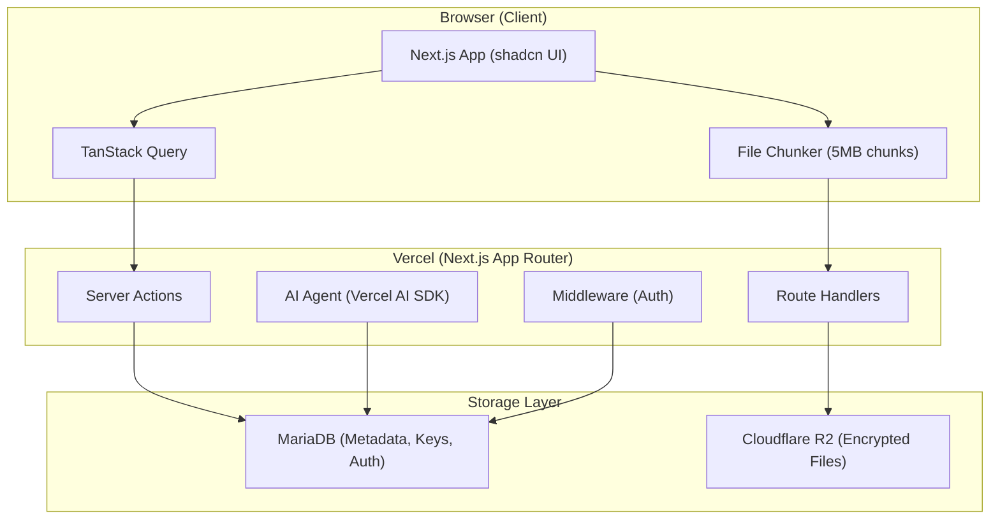
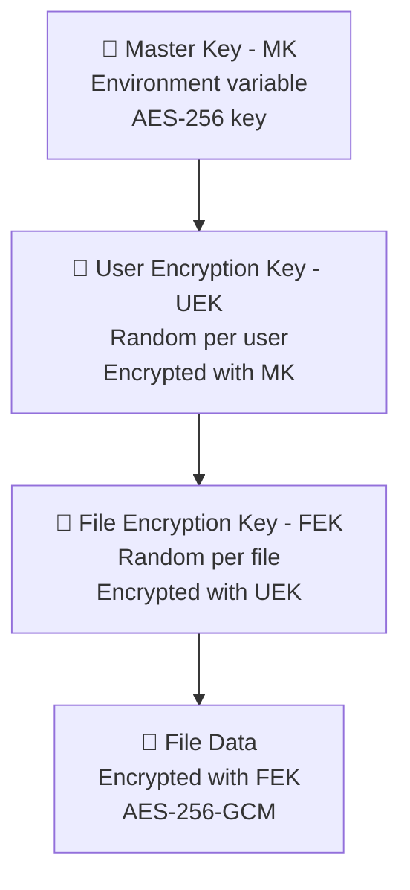
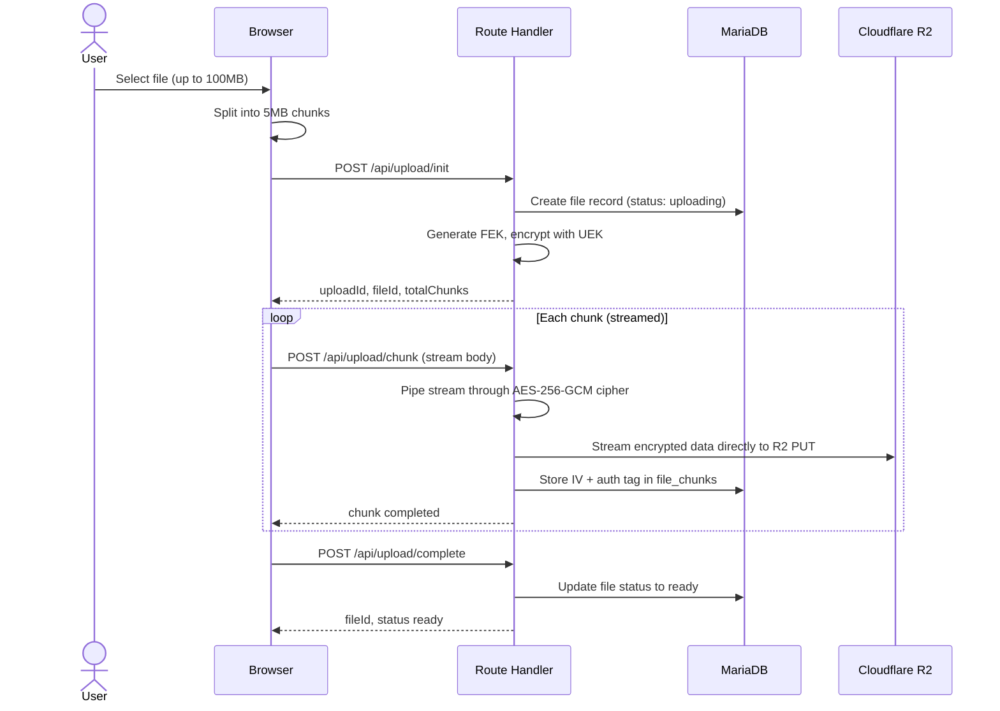
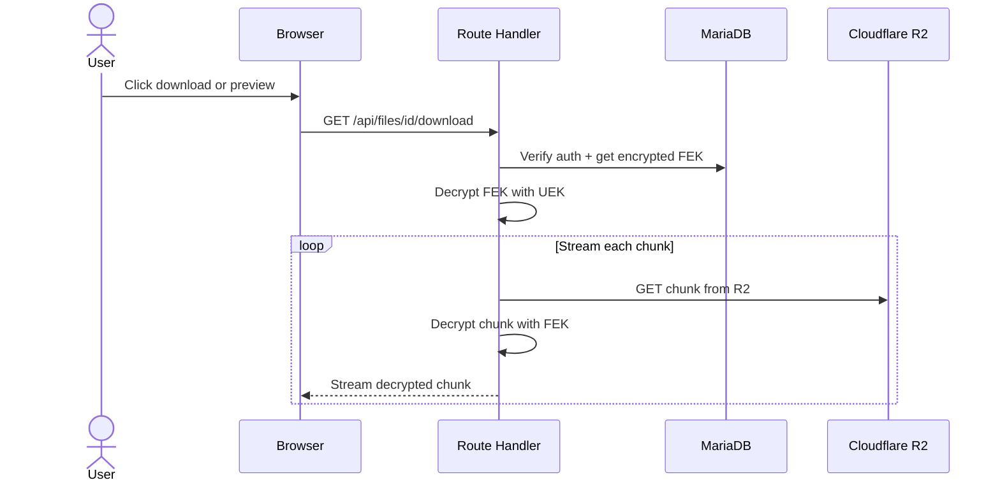
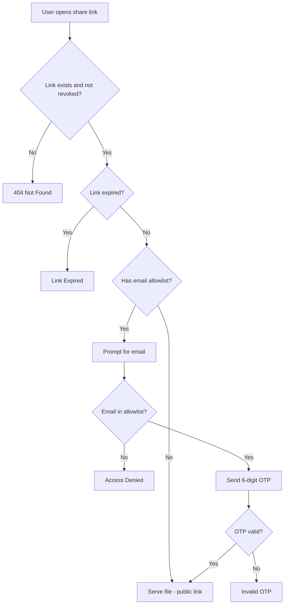
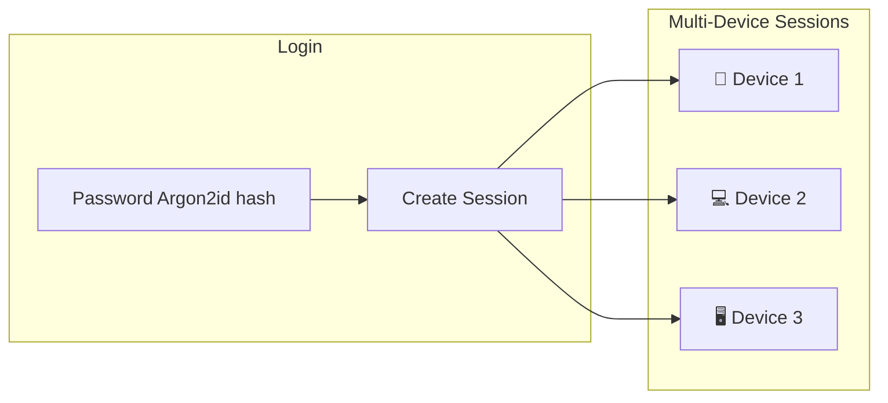
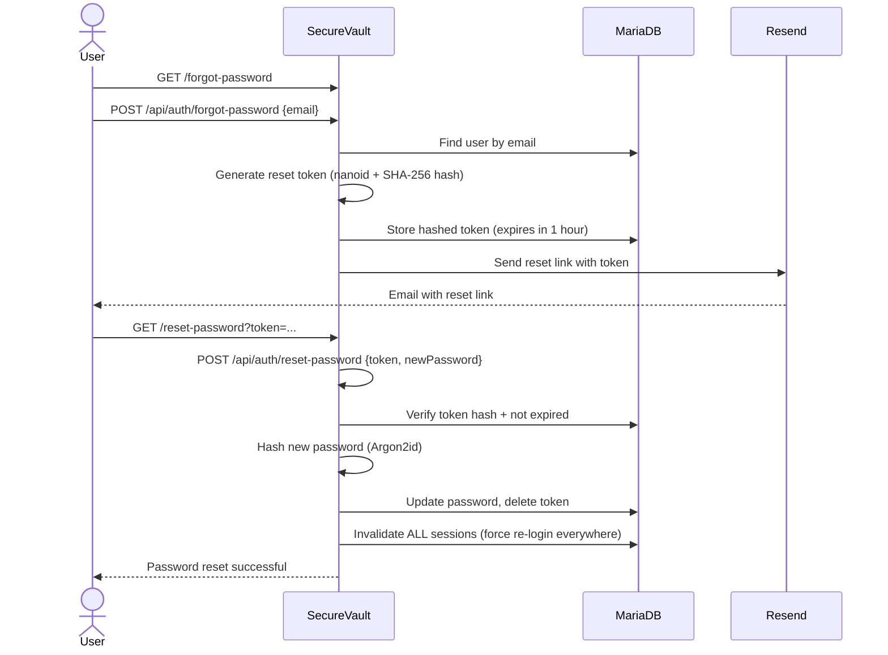
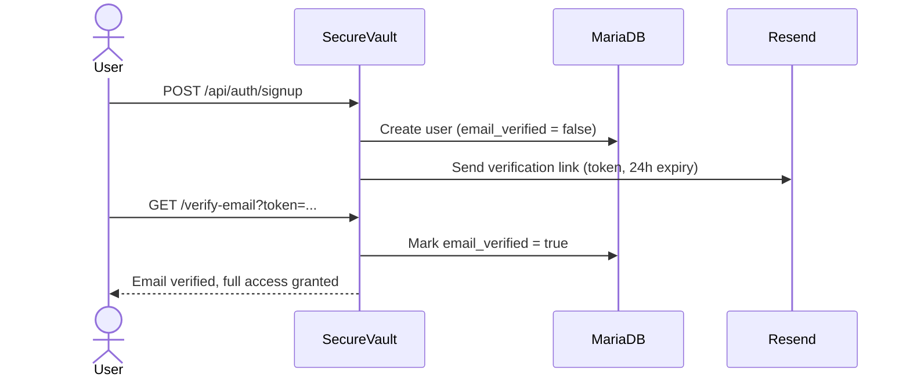
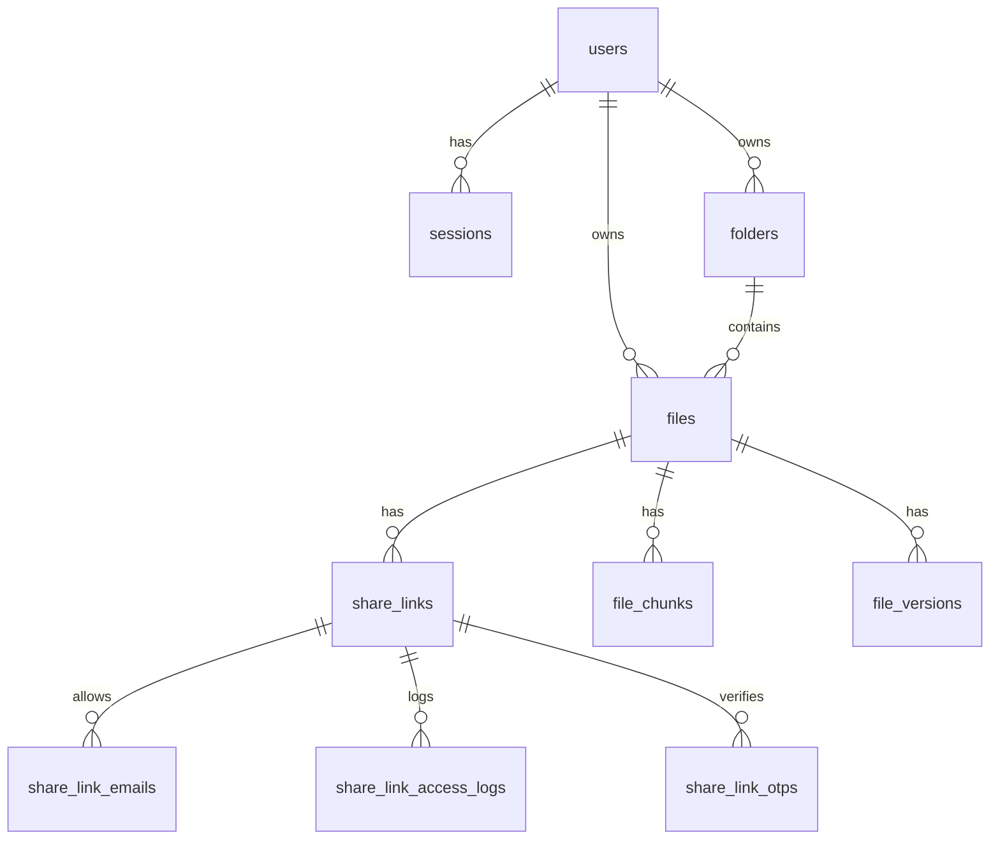

# SecureVault — Architecture

## System Diagram



## Architecture Decisions

### Why Server-Side Encryption (Not Client-Side)?

- **Simplicity**: No WebCrypto API complexity; no key management in the browser
- **Key hierarchy**: Master Key → User Encryption Key → File Encryption Key managed on server
- **Control**: Server can enforce policies (quota, rate limits) before accepting data

### Why Chunked Upload?

- **Vercel body limit**: 4.5MB max on serverless functions
- **Resumability**: Failed uploads resume from last successful chunk
- **Memory**: Chunks processed one at a time; no full-file buffering

### Why MariaDB (Not PostgreSQL)?

- Hackathon requirement (MariaDB Hackathon MY 2026)
- Railway provides managed MariaDB with free tier
- Application-level RLS compensates for lack of native row-level security

### Why Cloudflare R2 (Not S3)?

- **Zero egress fees** — file downloads don't incur costs
- S3-compatible API — same `@aws-sdk/client-s3` SDK
- Generous free tier (10GB storage, 10M reads/month)

## Encryption Key Hierarchy (3-Tier)



## Data Flow

### Upload (Chunked + Streamed)



### Download (Streaming)



### Sharing (Access Flow)



## Authentication



## Forgot Password Flow



## Email Verification Flow



## Folder Structure

```
securevault/
├── src/
│   ├── app/
│   │   ├── (auth)/login, signup
│   │   ├── (dashboard)/files, shared, settings, chat, activity, trash
│   │   ├── s/[token]/page.tsx         — public share link viewer
│   │   └── api/upload, files, share, chat, auth, cron
│   ├── lib/
│   │   ├── crypto/                    — AES-256-GCM, key mgmt
│   │   ├── auth/                      — sessions, middleware, Argon2id
│   │   ├── storage/                   — R2 client, chunked upload
│   │   ├── db/                        — Drizzle schema, migrations
│   │   ├── services/                  — scoped file/folder/share services
│   │   ├── ai/                        — tools, prompts (stretch)
│   │   └── email/                     — OTP & verification sender
│   ├── components/
│   │   ├── ui/                        — shadcn components
│   │   ├── file-explorer/             — grid/list view, toolbar
│   │   ├── upload/                    — upload dialog + progress
│   │   ├── share/                     — share link management
│   │   └── chat/                      — AI chat (stretch)
│   ├── hooks/                         — useUpload, useFiles
│   └── middleware.ts                  — auth guard
├── docs/                              — project documentation
├── resources/                         — security standards & references
├── tasks/                             — phase-based task breakdown
├── drizzle.config.ts
└── next.config.ts
```

## Database Schema (ER Diagram)



See full schema details in the [implementation plan](../tasks/README.md).
