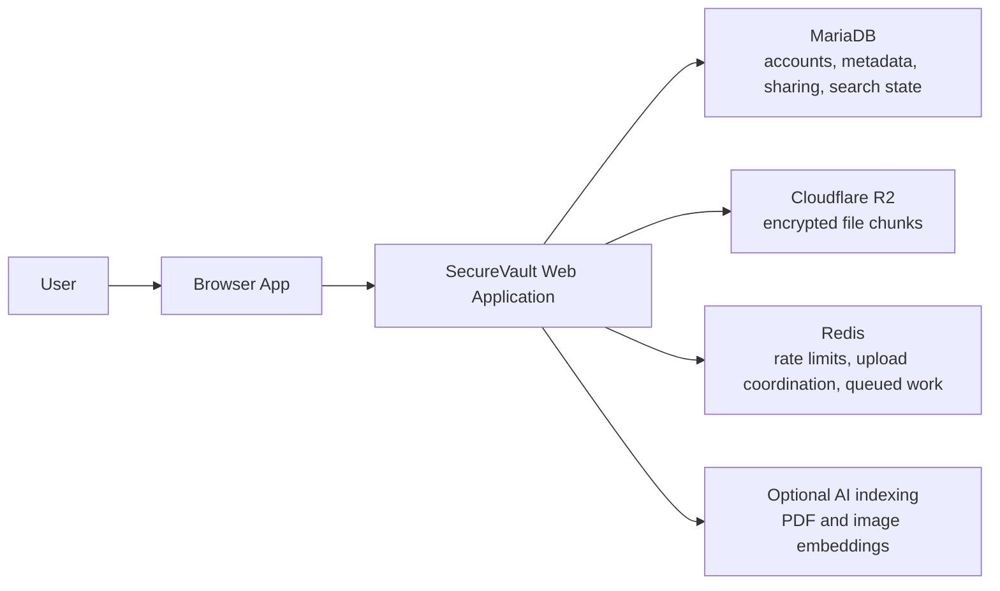
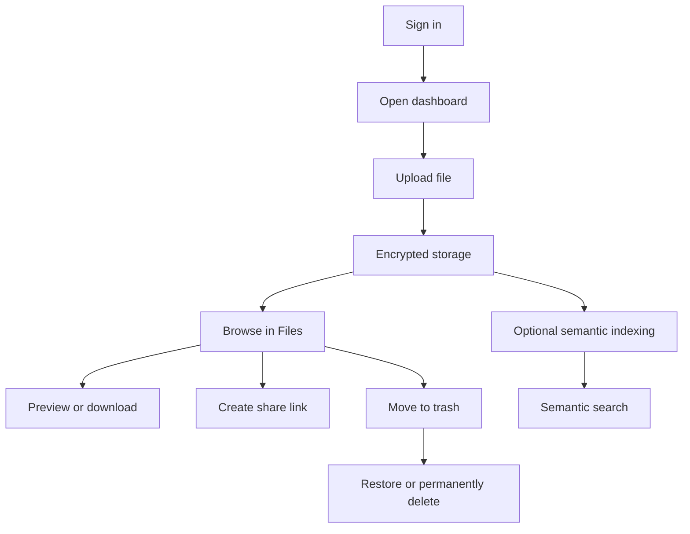
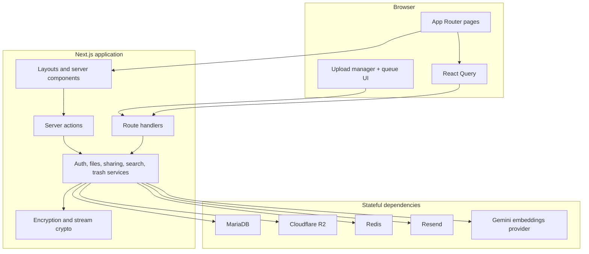
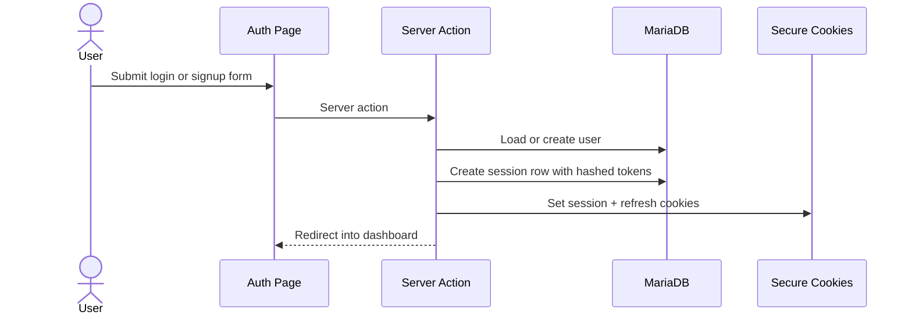
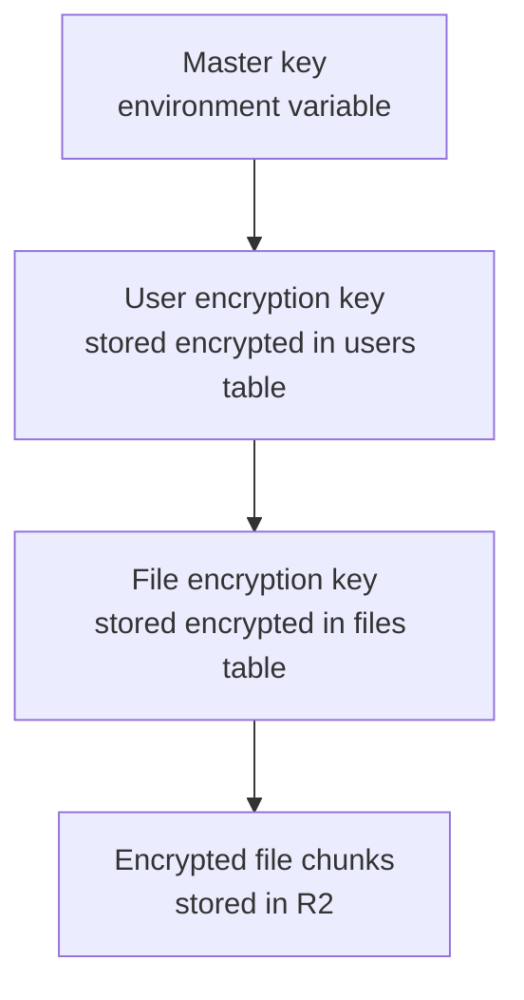
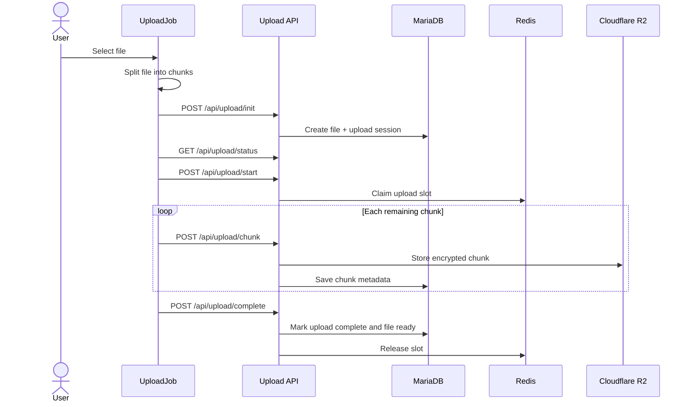
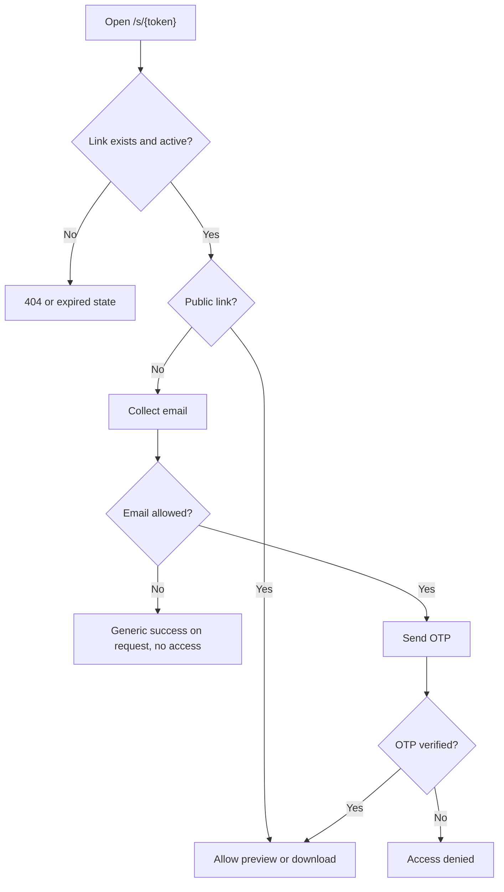
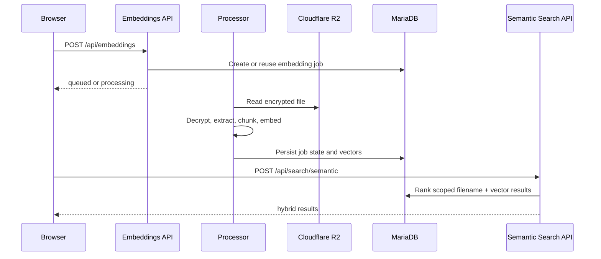
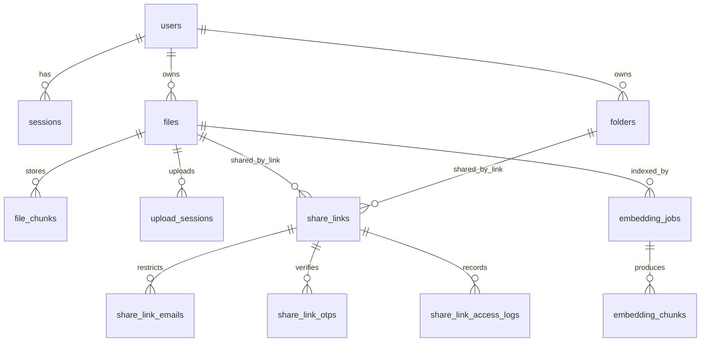

# SecureVault Project Handbook

This handbook documents the repository as it exists in code today.

- Product workspace root: `C:\Git_Repo\securevault`
- Active application: `C:\Git_Repo\securevault\secure-vault`
- Stack: Next.js App Router, React 19, TypeScript, Drizzle ORM, MariaDB, Redis, Cloudflare R2, optional Gemini-powered semantic indexing

## How To Read This Document

- Part 1 is written for non-technical readers, product stakeholders, demo reviewers, and new teammates.
- Part 2 is written for engineers who need to understand the implementation, architecture boundaries, data flow, and operational dependencies.
- The dedicated HTTP API reference lives in [05-api-reference.md](./05-api-reference.md).
- Docker and Compose runtime notes live in [06-docker-and-compose.md](./06-docker-and-compose.md).
- Playwright execution and case coverage live in [07-playwright-coverage.md](./07-playwright-coverage.md).

## Part 1: Simplified Overview For Non-Technical Readers

### What SecureVault Is

SecureVault is a secure file storage application. It lets people upload files, organize them into folders, preview and download them later, share them with other people through links, recover deleted items from trash, and optionally search files using semantic AI indexing.

The application is designed around one main promise:

- files should stay private and encrypted
- each user should only see their own data
- shared access should be explicit and controllable
- AI features should be additive, not required for normal file storage

Important scope note:

- this is server-managed encryption, not end-to-end encryption
- the server decrypts files for authorized preview, download, sharing, and indexing operations
- the goal is strong encrypted-at-rest handling and scoped access control inside the application boundary

### What A User Can Do Today

- create an account and sign in
- upload files through a resumable chunked upload flow
- organize files into folders
- rename, move, delete, and restore files and folders
- preview and download files
- generate share links for files or folders
- protect shared links by allowed email plus OTP verification
- see storage usage and biggest files
- see activity such as uploads, share creation, share revocation, and share access
- reset a forgotten password with email OTP
- optionally run semantic indexing for PDFs and images, then search indexed content semantically

### What The App Looks Like At A High Level

### Core User Journeys

#### 1. Sign In And Enter The Workspace

- Users log in or sign up through dedicated auth pages.
- Once authenticated, they enter the dashboard workspace.
- The main working areas are Files, Storage, Trash, Activity, and Settings.

#### 2. Upload Files

- The browser splits a file into chunks.
- The server creates an upload session and a file record.
- Each chunk is encrypted and stored in object storage.
- When all chunks are done, the file becomes available in the file library.
- If semantic indexing is enabled and the file is eligible, indexing starts after the upload finishes.

#### 3. Share Files Or Folders

- A signed-in owner can create a share link for a file or folder.
- A link can be public or restricted to specific email addresses.
- Restricted links require an OTP sent to an allowed email address.
- Access events are logged so the owner can see when a shared link was used.

#### 4. Delete And Recover

- Delete actions move files and folders into trash instead of destroying them immediately.
- Trashed items can be restored.
- Permanent deletion removes metadata and stored chunks and reclaims storage usage.

### Simple Workflow Diagram

### Why This Matters

SecureVault is not just a simple file browser. The project combines:

- secure authentication
- encrypted-at-rest file handling
- controlled sharing
- quota and lifecycle management
- optional AI search

That makes it suitable as a strong demo for a secure storage product, especially for a hackathon or portfolio setting where both user value and engineering depth matter.

## Part 2: Technical Reference For Engineers

### Repository Structure

| Path | Purpose |
| --- | --- |
| `secure-vault/src/app` | Next.js route groups, layouts, pages, API route handlers |
| `secure-vault/src/components` | UI and page-level client components |
| `secure-vault/src/hooks` | React Query hooks and upload queue hooks |
| `secure-vault/src/lib/auth` | session, cookies, current-user loading, password reset, request metadata |
| `secure-vault/src/lib/crypto` | AES helpers, key hierarchy, stream crypto, filename sanitization |
| `secure-vault/src/lib/db` | Drizzle connection, schema, CRUD helpers |
| `secure-vault/src/lib/files` | file explorer and storage dashboard query logic |
| `secure-vault/src/lib/sharing` | share link lifecycle, OTP flow, share access session |
| `secure-vault/src/lib/storage` | chunking helpers and Cloudflare R2 integration |
| `secure-vault/src/lib/upload` | browser upload scheduler and upload concurrency coordination |
| `secure-vault/src/lib/ai` | semantic indexing config, queueing, worker, providers |
| `secure-vault/src/lib/search` | filename search and hybrid semantic search |
| `secure-vault/tests` | unit, component, integration, and Playwright end-to-end coverage |
| `compose.yaml` | local MariaDB and Redis services plus optional app and worker containers |

### Runtime Architecture

SecureVault is implemented as a Next.js monolith with clear internal service boundaries:

- server-rendered pages and layouts handle auth gating and initial data loading
- client components handle rich workspace interaction
- server actions cover authenticated dashboard mutations
- route handlers cover JSON APIs, streaming downloads, uploads, sharing, and cron endpoints
- MariaDB stores all durable relational state
- Cloudflare R2 stores encrypted file chunks and thumbnails
- Redis backs rate limiting and optional queued background work

### Frontend Architecture

The user-facing app is primarily split into:

- `(auth)` for login, signup, forgot password, and reset password
- `(dashboard)` for the authenticated workspace
- `s/[token]` for public or restricted shared-link access

Key frontend patterns:

- `src/app/providers.tsx` wires `QueryClientProvider` and `UploadQueueProvider`
- dashboard layout uses `getCurrentUser()` and redirects unauthenticated users to `/login`
- page routes load initial data on the server, then hand off to client page-content components
- React Query hooks keep explorer, trash, storage, and current-user state in sync
- the upload queue is a singleton state machine exposed through context plus `useSyncExternalStore`

Important current-state note:

- `/` is still the default Next.js starter page
- `/chat` exists as a placeholder, not a finished workflow
- the real product entry point is the authenticated dashboard under `/files`, `/activity`, `/storage`, `/settings`, and `/trash`
- for demos and onboarding, treat `/files` as the practical “home” of the product

### Authentication And Session Model

Current auth behavior is implemented in server actions and shared auth utilities.

- login and signup are server actions
- passwords are hashed with Argon2
- the app stores hashed session and refresh tokens in MariaDB
- auth cookies are `__Secure-session` and `__Secure-refresh`
- current-user resolution happens server-side through the session cookie
- dashboard protection currently comes from layout-level user checks rather than a top-level middleware file

Password reset is separate from server actions:

- `POST /api/auth/password-reset/request-otp`
- `POST /api/auth/password-reset/reset`

The reset implementation uses:

- email normalization
- OTP hashing
- attempt counting
- short-lived OTP validity windows
- transaction-level protection against concurrent token consumption
- full session invalidation after password reset

### Encryption And File Security

The application uses a three-tier key hierarchy:

- master key from `MASTER_ENCRYPTION_KEY`
- one user encryption key per user
- one file encryption key per file

Implementation details confirmed in code:

- the master key must be a 64-character hex string
- UEKs and FEKs are generated as 32-byte random values
- UEKs are encrypted with the master key
- FEKs are encrypted with the owning user UEK
- file chunks store per-chunk IV and auth tag metadata in `file_chunks`
- shared downloads never expose raw storage keys to the client
- this is application-managed encryption at rest; the app server performs decrypt operations for authorized reads

### Upload Architecture

The upload path is one of the most important parts of the app.

Client-side:

- files are split into chunks by `src/lib/storage/chunker.ts`
- `UploadManager` schedules a bounded number of active uploads
- `UploadJob` handles init, resume, chunk upload, completion, and semantic follow-up

Server-side:

- `POST /api/upload/init` creates upload state and file metadata
- `GET /api/upload/status` supports resume
- `POST /api/upload/start` claims a concurrency slot
- `POST /api/upload/chunk` uploads one chunk
- `POST /api/upload/complete` finalizes the upload
- `POST /api/upload/release` releases the concurrency slot

Upload coordination details:

- upload concurrency is server-aware, not just a UI convenience
- active upload slots are claimed and released explicitly
- retries honor `Retry-After` where available
- if Redis is disabled in local development, coordination can fall back to a no-op adapter

Operational limits confirmed in code:

| Limit | Current value |
| --- | --- |
| Upload chunk size | 5 MiB |
| Maximum file upload size | 100 MiB |
| Maximum active uploads per user | 3 |
| Upload session expiry | 24 hours |
| Default storage quota | 1 GiB |
| Trash retention | 30 days |
| PDF semantic indexing size cap | 10 MiB |
| Eligible image types for semantic indexing | JPEG, PNG, WEBP, GIF, AVIF |
| Eligible document type for upload and indexing | PDF |

### File, Folder, Trash, And Storage Model

The file explorer is metadata-first and user-scoped.

- files are only listed when `status = ready` and `deleted_at is null`
- folders are user-scoped and soft-deletable
- trash is implemented as soft deletion on both files and folders
- permanent deletion purges rows and attempts to delete related R2 objects
- storage dashboards count active files separately from trash, but quota-used is tracked on the user and trash still matters operationally

Trash behavior:

- deleting a folder cascades soft deletion to descendants and contained files
- restoring a child requires its parent folder to be restored first
- permanent deletion also removes share links in scope
- cron cleanup can purge expired trash and stale uploads

### Sharing Model

Sharing is implemented for both individual files and folders.

- a share link targets either `file_id` or `folder_id`
- links can be public or restricted to an allowlist of emails
- restricted links require OTP verification
- verified share access is stored in a share access session
- access events are logged
- download counts can be capped

### Semantic Indexing And Search

Semantic indexing is optional and environment-gated.

- the browser triggers indexing only after upload success
- only eligible PDFs and image types are indexed
- indexing supports `inline` and `queued` execution modes
- queued execution requires Redis
- status is tracked per file and modality in `embedding_jobs`
- vectors and encrypted extracted text are stored in `embedding_chunks`

Search modes:

- filename search: simple scoped metadata search
- semantic search: query embedding plus hybrid ranking across the user’s own indexed chunks

Behavioral expectations:

- semantic indexing is optional and never blocks a successful upload from becoming downloadable
- if indexing is disabled, skipped, or fails, the file still remains usable in normal storage flows
- current indexing eligibility is limited to PDFs and selected image MIME types
- PDFs larger than 10 MiB are stored normally but skipped for semantic indexing
- the schema supports encrypted extracted text fields alongside vectors, but the core user-facing contract is semantic retrieval rather than exposing raw extracted text directly

### Data Model

Primary tables:

| Table | Purpose |
| --- | --- |
| `users` | account identity, password hash, encrypted UEK, quota counters |
| `sessions` | hashed session and refresh tokens plus device metadata |
| `folders` | user-owned hierarchical folders |
| `files` | file metadata, encrypted FEK, lifecycle state, thumbnails, trash state |
| `file_chunks` | one row per stored chunk with R2 key and crypto metadata |
| `upload_sessions` | resumable upload state and expiry |
| `share_links` | public or restricted share links |
| `share_link_emails` | allowlisted emails for restricted links |
| `share_link_otps` | OTP challenge state for restricted share access |
| `share_link_access_logs` | share access audit-style records |
| `file_versions` | versioning scaffold for future evolution |
| `embedding_jobs` | per-file semantic indexing job state |
| `embedding_chunks` | chunk text metadata and vector embeddings |
| `password_reset_tokens` | password-reset OTP state |
| `email_verification_tokens` | schema support for verification flow |

### Infrastructure And Dependencies

Local Compose services:

- MariaDB 12
- Redis 8
- optional `web` container
- optional `worker` container for the embeddings worker

Environment split:

- host-run app development uses `secure-vault/.env.local`
- containerized Compose app runs use the repo-root `.env`

Important environment variables:

| Group | Variables |
| --- | --- |
| Database | `DATABASE_HOST`, `DATABASE_PORT`, `DATABASE_NAME`, `DATABASE_USER`, `DATABASE_PASSWORD` |
| Encryption | `MASTER_ENCRYPTION_KEY` |
| Object storage | `R2_ACCOUNT_ID`, `R2_ACCESS_KEY_ID`, `R2_SECRET_ACCESS_KEY`, `R2_BUCKET_NAME` |
| Redis | `REDIS_URL`, `DISABLE_REDIS` |
| Email | `RESEND_API_KEY`, `NEXT_PUBLIC_APP_URL` |
| Cron | `CRON_SECRET` |
| Semantic indexing | `SEMANTIC_INDEXING_ENABLED`, `SEMANTIC_INDEXING_EXECUTION_MODE`, `SEMANTIC_INDEXING_PROVIDER`, `GEMINI_API_KEY`, related tuning variables |

### Security Controls Confirmed In Code

- signed-in dashboard access is enforced server-side
- auth cookies are `httpOnly`, `sameSite=strict`, and `secure`
- session and refresh tokens are stored hashed, not raw
- rate limiting exists for login, signup, password reset, sharing OTP, uploads, and downloads
- CSP and other security headers are configured in `next.config.ts`
- filenames are sanitized before persistence
- sharing checks are owner-scoped and token-scoped
- semantic search is user-scoped before returning ranked results

### Testing Strategy

The repository has meaningful automated coverage across:

- unit tests for crypto, auth, rate limiting, sharing, upload logic, search, and semantic indexing
- component tests for dashboard, files, trash, activity, and auth pages
- route tests for uploads, sharing, download, password reset, search, cron, and embeddings
- Playwright end-to-end flows for upload, sharing, semantic indexing, password reset, trash, storage search, and activity

### Current Implementation Notes

These are important for anyone onboarding:

- the dashboard experience is real; the marketing-style landing page at `/` is not yet wired to the product
- email verification is modeled in the schema and UI, but new signups are currently created with `email_verified: true`
- refresh token utilities exist, but the active route surface is centered on session-cookie validation
- the semantic indexing subsystem is feature-gated and can be unavailable without the correct environment
- `/chat` is present structurally but is not yet a completed product capability

## Recommended Reading Order For Engineers

1. `README.md`
2. `docs/05-api-reference.md`
3. `docs/06-docker-and-compose.md`
4. `docs/07-playwright-coverage.md`
5. `secure-vault/src/app`
6. `secure-vault/src/lib/auth`
7. `secure-vault/src/lib/upload`
8. `secure-vault/src/lib/sharing`
9. `secure-vault/src/lib/ai`
10. `secure-vault/src/lib/db/schema`
