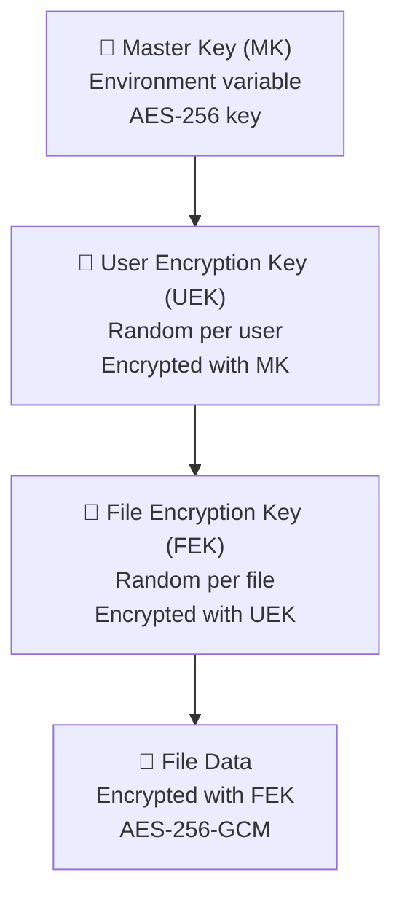

# SecureVault — Security Design

## Encryption Architecture

### 3-Tier Key Hierarchy



| Key                           | Generation                          | Storage                         | Rotation                      |
| ----------------------------- | ----------------------------------- | ------------------------------- | ----------------------------- |
| **Master Key (MK)**           | Generated once                      | `MASTER_ENCRYPTION_KEY` env var | Manual — re-encrypts all UEKs |
| **User Encryption Key (UEK)** | `crypto.randomBytes(32)` on signup  | MariaDB (encrypted with MK)     | On MK rotation                |
| **File Encryption Key (FEK)** | `crypto.randomBytes(32)` per upload | MariaDB (encrypted with UEK)    | Never (immutable per file)    |

### Design Rationale

- **DB breach**: UEKs useless without MK (env var)
- **User isolation**: Each user has unique UEK; one compromise doesn't affect others
- **File deletion**: Deleting FEK makes file irrecoverable even if blob remains
- **Password change**: UEK not derived from password, so no re-encryption needed

## Authentication Security

| Measure                 | Implementation                                     |
| ----------------------- | -------------------------------------------------- |
| **Password hashing**    | Argon2id (memory-hard, timing-resistant)           |
| **Password strength**   | zxcvbn score ≥ 3 required                          |
| **Session tokens**      | 15 min expiry, httpOnly + Secure + SameSite=Strict |
| **Refresh tokens**      | 30 day expiry, hashed in DB, `__Secure-refresh`    |
| **Cookie prefix**       | `__Secure-` prefix prevents plain HTTP overwrites  |
| **Account enumeration** | Same error for wrong email and wrong password      |

## Threat Model

| Threat            | Mitigation                                         |
| ----------------- | -------------------------------------------------- |
| R2 bucket leak    | Files encrypted with per-file FEKs                 |
| DB leak           | UEKs encrypted with MK (env var)                   |
| MK compromise     | Rotate MK → re-encrypt all UEKs                    |
| Session hijacking | httpOnly + Secure + SameSite=Strict                |
| Brute-force login | Rate limiting (5/15min) + Argon2id cost            |
| OTP brute-force   | Max 3 attempts, 5 min expiry, hashed storage       |
| Link enumeration  | 32-char nanoid = 10^57 possibilities               |
| XSS on preview    | CSP headers, sanitize filenames                    |
| CSRF              | Server Actions have built-in CSRF protection       |
| Path traversal    | R2 keys from validated IDs only, never user paths  |
| Timing attacks    | `crypto.timingSafeEqual()` for all comparisons     |
| IDOR              | All queries scoped by `userId` via service pattern |
| Open redirect     | Validate redirect URL is relative, starts with `/` |

## Rate Limiting

| Endpoint         | Limit        | Window | Key          |
| ---------------- | ------------ | ------ | ------------ |
| Login            | 5 attempts   | 15 min | IP + email   |
| Signup           | 5 attempts   | 1 hour | IP           |
| Forgot password  | 3 attempts   | 15 min | IP           |
| OTP verification | 3 attempts   | 5 min  | IP + token   |
| Upload           | 100 requests | 1 min  | user ID      |
| Download         | 30 requests  | 1 min  | user ID / IP |

## Security Headers

```
X-Content-Type-Options: nosniff
X-Frame-Options: DENY
X-XSS-Protection: 1; mode=block
Referrer-Policy: strict-origin-when-cross-origin
Content-Security-Policy: default-src 'self'; frame-src 'none';
```

## Input Validation

| Input         | Validation                                                    |
| ------------- | ------------------------------------------------------------- | ------------------- |
| Filenames     | Sanitize on upload init (strip `/\:\*?"<>                     | `, `..`, limit 255) |
| MIME types    | Server-side `file-type` detection, ignore client Content-Type |
| File size     | Max 100MB per file, enforced server-side                      |
| Storage quota | 1GB per user, checked before upload init                      |
| Redirect URLs | Must be relative, start with `/`, no `//`                     |

## Security Testing Strategy

| Layer      | Tool                           | What It Catches                               |
| ---------- | ------------------------------ | --------------------------------------------- |
| **Unit**   | Vitest                         | Encryption round-trip, key isolation, IDOR    |
| **E2E**    | Playwright                     | Link revocation, OTP brute force, token reuse |
| **Manual** | DevTools + securityheaders.com | Cookie flags, headers, quota enforcement      |
