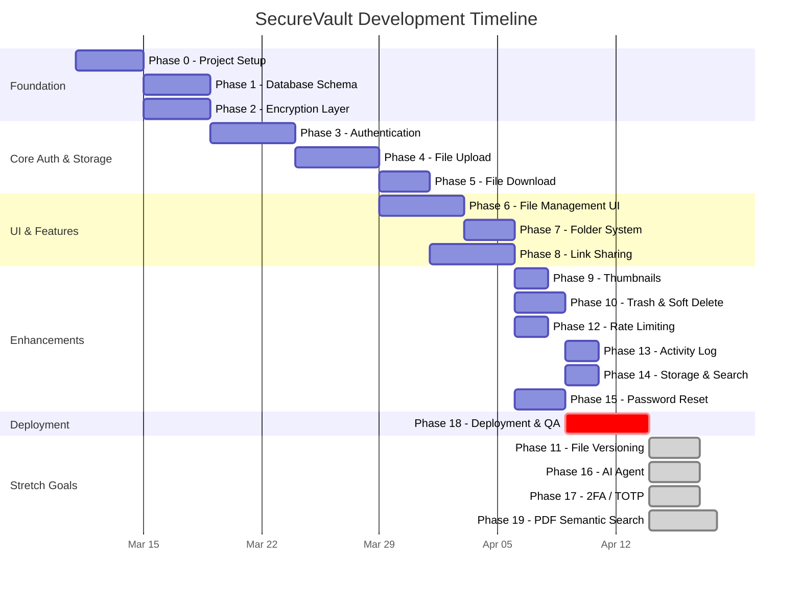

# GitHub Issues - Task Assignments & Timeline

**Timeline:** March 11 - April 9, 2026 (~30 days)
**Deadline buffer:** Finishing 3 weeks before April 30 hard deadline.

---

## Timeline Chart

---

## Issue #1: Phase 0 - Project Setup

**Title:** `[Setup] Finalize system architecture and project scaffold`
**Labels:** `architecture`, `priority: critical`
**Assignee:** _Team Lead / Full-Stack_
**Start:** March 11, 2026
**Due:** March 14, 2026

### Description

Set up the Next.js project, install all dependencies, configure environment variables, create the folder structure, and establish security headers.

### Acceptance Criteria

- [ ] Next.js dev server runs at `localhost:3000`
- [ ] All directories from Phase 0 created
- [ ] Security headers configured in `next.config.ts`
- [ ] Vitest runs successfully
- [ ] `.env.example` documents all required env vars

**References:** [`tasks/phase-00-project-setup.md`](../tasks/phase-00-project-setup.md), [`docs/02-architecture.md`](../docs/02-architecture.md)

---

## Issue #2: Phase 1 - Database Schema

**Title:** `[Database] Design and implement MariaDB schema with Drizzle ORM`
**Labels:** `database`, `priority: critical`
**Assignee:** _Backend Developer_
**Start:** March 15, 2026
**Due:** March 18, 2026

### Description

Define all Drizzle schemas (users, sessions, files, chunks, folders, sharing tables, upload sessions, file versions). Run migrations to Railway MariaDB. Create required indexes.

### Acceptance Criteria

- [ ] All 10+ tables exist in MariaDB
- [ ] DB connection singleton uses `globalThis` caching pattern and enforces UTC timezone ('Z')
- [ ] All indexes from blueprint applied
- [ ] `npx tsc --noEmit` passes (schema types valid)

**References:** [`tasks/phase-01-database-schema.md`](../tasks/phase-01-database-schema.md)

---

## Issue #3: Phase 2 - Encryption Layer

**Title:** `[Security] Implement AES-256-GCM encryption layer and key hierarchy`
**Labels:** `security`, `encryption`, `priority: critical`
**Assignee:** _Backend Developer / Security Lead_
**Start:** March 15, 2026
**Due:** March 18, 2026

### Description

Build the 3-tier key hierarchy (MK -> UEK -> FEK), AES-256-GCM encrypt/decrypt utilities, timing-safe comparison, and filename sanitization. Write comprehensive tests.

### Acceptance Criteria

- [ ] Encrypt -> decrypt round-trip returns exact bytes
- [ ] Decrypt with wrong key throws error
- [ ] UEK/FEK key wrapping works correctly
- [ ] 14+ security test cases pass in Vitest
- [ ] `safeCompare()` handles equal, unequal, and different-length strings

**References:** [`tasks/phase-02-encryption-layer.md`](../tasks/phase-02-encryption-layer.md), [`docs/04-security-design.md`](../docs/04-security-design.md)

---

## Issue #4: Phase 3 - Authentication

**Title:** `[Auth] Build session-based multi-device authentication system`
**Labels:** `auth`, `security`, `priority: critical`
**Assignee:** _Full-Stack Developer_
**Start:** March 19, 2026
**Due:** March 23, 2026

### Description

Implement Argon2id password hashing, session management with refresh tokens, auth middleware, secure cookies, login/signup pages, and the scoped `getCurrentUser` helper.

### Acceptance Criteria

- [ ] Signup -> login -> dashboard redirect works
- [ ] Cookies have HttpOnly + Secure + SameSite=Strict
- [ ] Wrong password returns same error as wrong email
- [ ] Unauthenticated access to `/dashboard/*` redirects to `/login`
- [ ] Auto-refresh using refresh token works silently
- [ ] Password strength validation rejects weak passwords

**References:** [`tasks/phase-03-authentication.md`](../tasks/phase-03-authentication.md)

---

## Issue #5: Phase 4 - File Upload

**Title:** `[Storage] Implement chunked file upload with server-side encryption`
**Labels:** `storage`, `encryption`, `priority: critical`
**Assignee:** _Backend Developer_
**Start:** March 24, 2026
**Due:** March 28, 2026

### Description

Build the full upload pipeline: R2 client, init/chunk/complete route handlers, client-side chunker, `useUpload` hook, upload dialog UI, and MIME validation.

### Acceptance Criteria

- [ ] Small file (< 5MB) uploads successfully
- [ ] Multi-chunk file (~15MB) shows progress bar across 3 chunks
- [ ] Files > 100MB rejected
- [ ] Quota > 1GB rejected
- [ ] Filename explicitly sanitized server-side during upload init
- [ ] Encrypted chunks visible in R2 at `/{userId}/files/{fileId}/chunk_*`
- [ ] Upload dialog supports drag-and-drop

**References:** [`tasks/phase-04-file-upload.md`](../tasks/phase-04-file-upload.md)

---

## Issue #6: Phase 5 - File Download & Preview

**Title:** `[Storage] Implement streaming file download and preview with decryption`
**Labels:** `storage`, `encryption`, `priority: critical`
**Assignee:** _Backend Developer_
**Start:** March 29, 2026
**Due:** March 31, 2026

### Description

Build streaming download and preview route handlers. Decrypt chunks from R2 on-the-fly. Implement parallel chunk pipeline for performance.

### Acceptance Criteria

- [ ] Downloaded file matches original (checksum)
- [ ] PDF previews in browser
- [ ] Images display inline
- [ ] IDOR: accessing another user's file returns 404
- [ ] `Content-Disposition` headers correct for download vs preview

**References:** [`tasks/phase-05-file-download.md`](../tasks/phase-05-file-download.md)

---

## Issue #7: Phase 6 - File Management UI

**Title:** `[UI] Build file explorer with grid/list views, rename, move, and bulk operations`
**Labels:** `frontend`, `ui`, `priority: high`
**Assignee:** _Frontend Developer_
**Start:** March 29, 2026
**Due:** April 2, 2026

### Description

Build scoped file service, file explorer (grid + list views), toolbar, rename/move/delete actions, bulk selection, mobile responsiveness, and confirmation dialogs.

### Acceptance Criteria

- [ ] File grid and list views toggle
- [ ] Right-click context menu with rename/move/share/delete
- [ ] Bulk select + delete, move, share works
- [ ] Mobile-responsive layout (single column, collapsible sidebar)
- [ ] Confirmation dialogs and toast notifications
- [ ] User B cannot see user A's files

**References:** [`tasks/phase-06-file-management-ui.md`](../tasks/phase-06-file-management-ui.md)

---

## Issue #8: Phase 7 - Folder System

**Title:** `[Folders] Implement folder CRUD, nested navigation, and breadcrumbs`
**Labels:** `frontend`, `ui`, `priority: high`
**Assignee:** _Frontend Developer_
**Start:** April 3, 2026
**Due:** April 5, 2026

### Description

Implement folder service, create folder dialog, breadcrumb navigation, and integrate folders into the file explorer. Support folder move with circular reference prevention and recursive soft-delete.

### Acceptance Criteria

- [ ] Create folder at root and nested levels
- [ ] Breadcrumb navigation shows correct path
- [ ] Folders appear before files in explorer
- [ ] Folder delete cascades to all contained files
- [ ] Circular folder moves prevented

**References:** [`tasks/phase-07-folder-system.md`](../tasks/phase-07-folder-system.md)

---

## Issue #9: Phase 8 - Link Sharing

**Title:** `[Sharing] Implement secure link sharing with OTP, expiry, and access control`
**Labels:** `security`, `sharing`, `priority: high`
**Assignee:** _Full-Stack Developer_
**Start:** March 31, 2026
**Due:** April 4, 2026

### Description

Build share link service (create/revoke/list), OTP verification, email service (Resend), share viewer page, download counter, access logging, and folder sharing.

### Acceptance Criteria

- [ ] Public link works in incognito
- [ ] Email-restricted link: enter email -> receive OTP -> access
- [ ] OTP lockout after 3 wrong attempts
- [ ] Revoked link returns 404
- [ ] Expired link shows "Link Expired"
- [ ] Download counter limits access
- [ ] Access logs recorded

**References:** [`tasks/phase-08-link-sharing.md`](../tasks/phase-08-link-sharing.md)

---

## Issue #10: Phase 9 - Thumbnail Generation

**Title:** `[Media] Generate encrypted thumbnails for images during upload`
**Labels:** `enhancement`, `storage`, `priority: medium`
**Assignee:** _Backend Developer_
**Start:** April 6, 2026
**Due:** April 7, 2026

### Description

Implement thumbnail generation using `sharp` (256x256 WebP), integrate into the upload complete flow, serve via decryption pipeline, and display in file explorer.

### Acceptance Criteria

- [ ] Image thumbnails appear in file grid (not generic icons)
- [ ] Non-image files show generic icons without errors
- [ ] Thumbnails <= 256x256 px and <= 50KB
- [ ] Encrypted thumbnails stored in R2 at `/{userId}/thumbnails/{fileId}.webp`

**References:** [`tasks/phase-09-thumbnails.md`](../tasks/phase-09-thumbnails.md)

---

## Issue #11: Phase 10 - Trash & Soft Delete

**Title:** `[Trash] Implement trash view, restore, permanent delete, and auto-cleanup cron`
**Labels:** `frontend`, `backend`, `priority: high`
**Assignee:** _Full-Stack Developer_
**Start:** April 6, 2026
**Due:** April 8, 2026

### Description

Build trash operations in the file service, trash page UI, navigation badge, and a consolidated cleanup cron (trash auto-purge + stale upload cleanup).

### Acceptance Criteria

- [ ] Deleted files appear in Trash view
- [ ] Restore returns file to file explorer
- [ ] Permanent delete removes R2 chunks + DB records
- [ ] "Empty Trash" clears all trashed files
- [ ] Cron auto-purges items older than 30 days
- [ ] Storage usage decreases after permanent delete

**References:** [`tasks/phase-10-trash-soft-delete.md`](../tasks/phase-10-trash-soft-delete.md)

---

## Issue #12: Phase 11 - File Versioning _(Stretch)_

**Title:** `[Versioning] Allow re-uploading new versions of a file (last 5 versions)`
**Labels:** `enhancement`, `stretch`, `priority: low`
**Assignee:** _Full-Stack Developer_
**Start:** _After deployment - if time permits_
**Due:** _Best effort before April 30_

### Description

Implement version service, "Upload New Version" UI, and version history panel. Auto-delete oldest when > 5 versions. All versions count toward storage quota.

### Acceptance Criteria

- [ ] Upload new version -> version history shows v1 and v2
- [ ] Download specific version returns correct content
- [ ] Restore old version promotes it to current
- [ ] Auto-delete when > 5 versions

**References:** [`tasks/phase-11-file-versioning.md`](../tasks/phase-11-file-versioning.md)

---

## Issue #13: Phase 12 - Rate Limiting & Security Hardening

**Title:** `[Security] Rate limiting and security hardening`
**Labels:** `security`, `priority: high`
**Assignee:** _Security Lead / Backend Developer_
**Start:** April 5, 2026
**Due:** April 6, 2026

### Description

Implement rate limiter, apply to all sensitive endpoints, audit all token comparisons for timing safety.

### Acceptance Criteria

- [ ] Rate limiting active on login, signup, OTP, upload, download
- [ ] 6th login attempt returns 429
- [ ] All token comparisons use `safeCompare()`

**References:** [`tasks/phase-12-rate-limiting-security.md`](../tasks/phase-12-rate-limiting-security.md)

---

## Issue #14: Phase 13 - Activity / Audit Log UI

**Title:** `[Activity] Build user-facing audit log showing file access events`
**Labels:** `frontend`, `enhancement`, `priority: medium`
**Assignee:** _Frontend Developer_
**Start:** April 8, 2026
**Due:** April 9, 2026

### Description

Implement activity service, build timeline-style activity page with event icons, and add navigation link to dashboard sidebar.

### Acceptance Criteria

- [ ] Activity log shows file access, upload, share link events
- [ ] Paginated, newest first
- [ ] Activity scoped to current user only (no cross-user leaks)

**References:** [`tasks/phase-13-activity-log.md`](../tasks/phase-13-activity-log.md)

---

## Issue #15: Phase 14 - Storage Dashboard & Search

**Title:** `[Storage] Show storage usage breakdown and implement file search`
**Labels:** `frontend`, `enhancement`, `priority: medium`
**Assignee:** _Frontend Developer_
**Start:** April 8, 2026
**Due:** April 9, 2026

### Description

Build storage usage dashboard (progress bar, breakdown by file type, largest files list), client-side quick filter, and server-side full-text search.

### Acceptance Criteria

- [ ] Storage progress bar reflects actual usage vs 1GB quota
- [ ] Breakdown by file type shown
- [ ] Quick filter by filename works instantly
- [ ] Full-text search returns matching files

**References:** [`tasks/phase-14-storage-search.md`](../tasks/phase-14-storage-search.md)

---

## Issue #16: Phase 15 - Password Reset & Email Verification

**Title:** `[Auth] Implement forgot-password flow and email verification`
**Labels:** `auth`, `security`, `priority: high`
**Assignee:** _Full-Stack Developer_
**Start:** April 5, 2026
**Due:** April 7, 2026

### Description

Build email service (Resend/Gmail SMTP), forgot-password flow (request -> token -> reset), email verification for new signups, and "Resend verification" UI.

### Acceptance Criteria

- [ ] Forgot password -> email received with reset link
- [ ] Use reset link -> change password -> old sessions invalidated
- [ ] Reset link is one-time use
- [ ] Signup -> verification email sent
- [ ] Click verify link -> `email_verified = true`
- [ ] Unverified user blocked from upload/share/AI

**References:** [`tasks/phase-15-password-reset-email-verify.md`](../tasks/phase-15-password-reset-email-verify.md)

---

## Issue #17: Phase 16 - AI Agent _(Stretch)_

**Title:** `[AI] Build AI-powered file assistant using Vercel AI SDK`
**Labels:** `enhancement`, `stretch`, `priority: low`
**Assignee:** _Full-Stack Developer_
**Start:** _After deployment - if time permits_
**Due:** _Best effort before April 30_

### Description

Set up Vercel AI SDK, implement AI tools (searchFiles, getFileInfo, summarizeFile, createShareLink), and build streaming chat UI.

### Acceptance Criteria

- [ ] Ask "find my tax docs" -> returns matching files
- [ ] Ask "share report.pdf" -> creates share link
- [ ] Streaming chat interface works

**References:** [`tasks/phase-16-ai-agent.md`](../tasks/phase-16-ai-agent.md)

---

## Issue #18: Phase 17 - 2FA / TOTP _(Stretch)_

**Title:** `[Auth] Add optional TOTP-based two-factor authentication`
**Labels:** `auth`, `security`, `stretch`, `priority: low`
**Assignee:** _Full-Stack Developer_
**Start:** _After deployment - if time permits_
**Due:** _Best effort before April 30_

### Description

Implement TOTP service (otpauth + qrcode), build 2FA setup UI in settings, and integrate into login flow with backup codes.

### Acceptance Criteria

- [ ] Enable 2FA -> QR code shown
- [ ] Login with correct TOTP -> session created
- [ ] Login with wrong TOTP -> rejected
- [ ] Login with backup code -> works (one-time)

**References:** [`tasks/phase-17-2fa-totp.md`](../tasks/phase-17-2fa-totp.md)

---

## Issue #19: Phase 18 - Deployment & Final QA

**Title:** `[Deploy] Deploy to Vercel, run full security checklist, and E2E tests`
**Labels:** `deployment`, `testing`, `priority: critical`
**Assignee:** _Team Lead / Security Lead_
**Start:** April 8, 2026
**Due:** April 12, 2026

### Description

Configure Vercel project, run full Vitest suite, run Playwright E2E security tests, complete manual pre-deployment checklist, production build test, and deploy.

### Acceptance Criteria

- [ ] All Vitest unit/integration tests pass
- [ ] Playwright E2E: link revocation, OTP brute force, token reuse tests pass
- [ ] Cookie flags verified (HttpOnly, Secure, SameSite=Strict)
- [ ] securityheaders.com scan -> A rating
- [ ] `npm run build` succeeds, production server works
- [ ] Deployed to Vercel and smoke test passes

**References:** [`tasks/phase-18-deployment-qa.md`](../tasks/phase-18-deployment-qa.md)

---

## Issue #20: Phase 19 - PDF Semantic Indexing & Search _(Post-MVP Enhancement)_

**Title:** `[AI/Search] Add PDF-only semantic indexing and search`
**Labels:** `enhancement`, `search`, `stretch`, `priority: low`
**Assignee:** _Full-Stack Developer_
**Start:** _After deployment - if time permits_
**Due:** _Best effort before April 30_

### Description

Add a separate, client-triggered PDF semantic indexing pipeline for uploaded PDFs that are `application/pdf` and `<= 10MB`. Keep the original upload, download, preview, and filename search flows unchanged while adding semantic retrieval backed by MariaDB vectors, Gemini embeddings, and a pluggable OCR layer.

### Acceptance Criteria

- [ ] Upload a PDF under 10MB -> upload completes first, indexing starts separately
- [ ] Upload a PDF over 10MB -> upload succeeds and indexing is skipped with a reason
- [ ] Non-PDF uploads never create semantic indexing jobs
- [ ] Semantic search returns relevant PDF results with snippet/page metadata
- [ ] Re-triggering indexing does not duplicate vector rows
- [ ] OCR or embedding failure does not regress file download/preview behavior
- [ ] Future AI agent can reuse semantic chunks instead of re-indexing PDFs

**References:** [`tasks/phase-19-pdf-semantic-indexing.md`](../tasks/phase-19-pdf-semantic-indexing.md), [`implementation_plan.md`](../implementation_plan.md)

---

## Summary

| #   | Phase               | Dates        | Days |
| --- | ------------------- | ------------ | ---- |
| 1   | Project Setup              | Mar 11-14    | 4 |
| 2   | Database Schema            | Mar 15-18    | 4 |
| 3   | Encryption Layer           | Mar 15-18    | 4 |
| 4   | Authentication             | Mar 19-23    | 5 |
| 5   | File Upload                | Mar 24-28    | 5 |
| 6   | File Download              | Mar 29-31    | 3 |
| 7   | File Management UI         | Mar 29-Apr 2 | 5 |
| 8   | Folder System              | Apr 3-5      | 3 |
| 9   | Link Sharing               | Mar 31-Apr 4 | 5 |
| 10  | Thumbnails                 | Apr 6-7      | 2 |
| 11  | Trash & Soft Delete        | Apr 6-8      | 3 |
| 12  | File Versioning            | _Stretch_    | - |
| 13  | Rate Limiting              | Apr 5-6      | 2 |
| 14  | Activity Log               | Apr 8-9      | 2 |
| 15  | Storage & Search           | Apr 8-9      | 2 |
| 16  | Password Reset             | Apr 5-7      | 3 |
| 17  | AI Agent                   | _Stretch_    | - |
| 18  | 2FA / TOTP                 | _Stretch_    | - |
| 19  | Deployment & QA            | Apr 8-12     | 5 |
| 20  | PDF Semantic Search | _Stretch_    | -    |

**Core completion:** April 12, 2026 - **18 days before** the April 30 deadline.
**Stretch goals window:** April 13-30 (18 days for bonus features).
