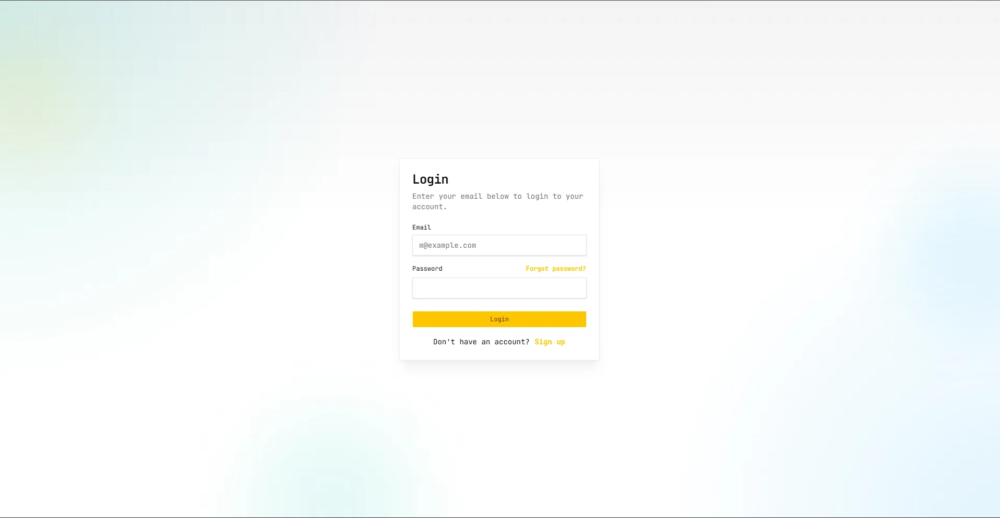
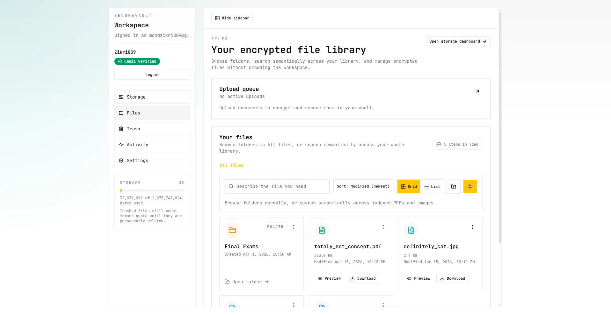
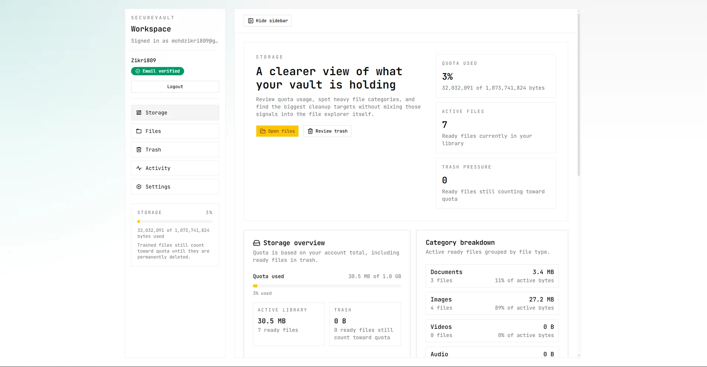
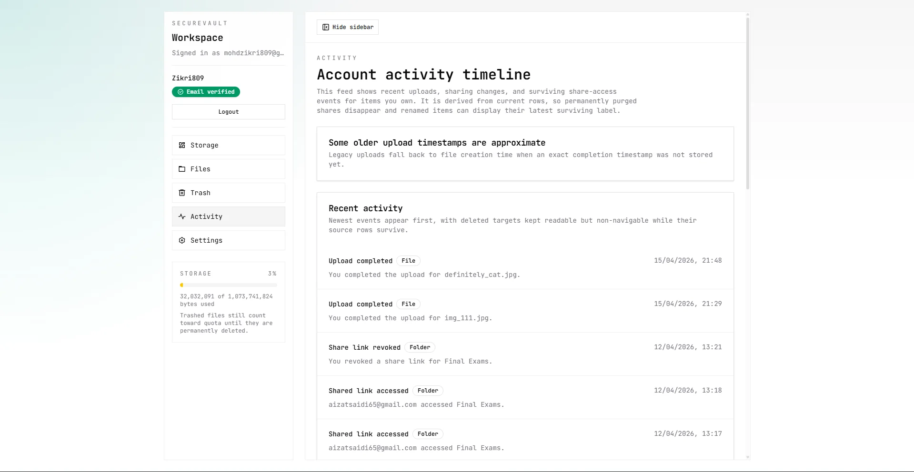
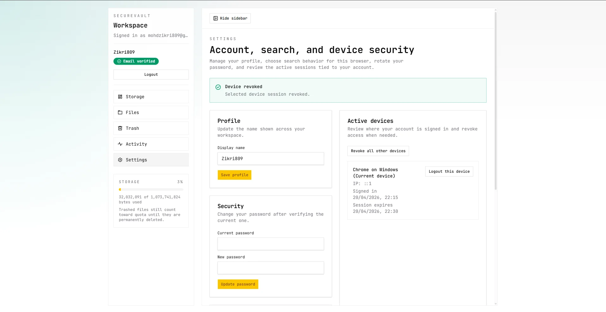
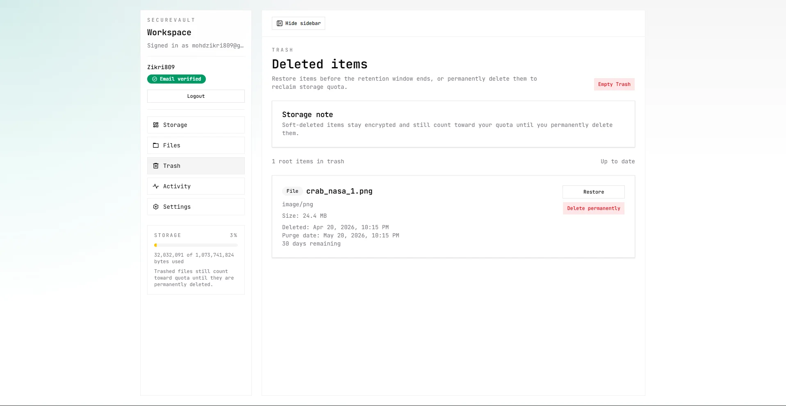

# SecureVault UI Showcase

This page collects the current product screenshots stored in `../assets/` so reviewers can scan the implemented UI without running the app first.

## Landing Page

The public-facing entry point presents the product positioning before users move into authentication and the dashboard workflow.

## Login

The authentication flow uses the same visual system as the dashboard: mono-first typography, bordered shells, and restrained accent color.

## Files

The file workspace is the main operating surface for uploads, browsing, preview, organization, and bulk actions.

## Storage

The storage dashboard exposes quota usage, largest files, and category-level visibility into account consumption.

## Activity

The activity feed makes uploads, sharing, and other account events visible in a single audit-style timeline.

## Settings

Settings groups account management and related user controls into the same dashboard language as the rest of the product.

## Trash

Trash supports recovery-oriented workflows so users can inspect and restore deleted content before permanent removal.

