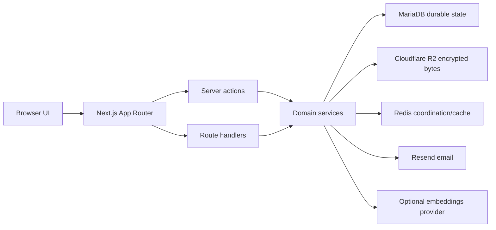
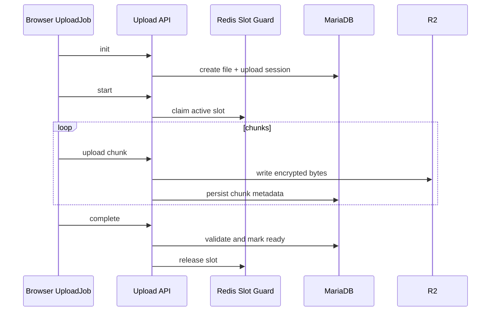

# Technical Feature Architecture

This page maps SecureVault's major product features to the engineering choices behind them. It is meant to help technical reviewers see why the project is more than a polished UI.

## Architecture Principles

SecureVault follows a few consistent design rules:

- keep durable product state in MariaDB
- keep large encrypted bytes in object storage
- use Redis for coordination, rate limits, and hot cache paths
- repeat authorization checks on server routes and actions
- let AI features enhance storage without blocking core storage flows
- document honest limits instead of overselling browser-only controls

## Auth And Account Recovery

### Implementation

- Server actions handle login and signup.
- Password reset uses API routes for OTP request and reset.
- Sessions and refresh tokens are hashed before persistence.
- Password reset tokens are hashed and stored with expiry, attempt count, and consumed state.

### Scalability And Production Readiness

- MariaDB gives a consistent source of truth for sessions and recovery state.
- Transactional token consumption prevents race conditions during password reset.
- Session invalidation after reset gives a clean security boundary after credential recovery.
- Rate limits protect recovery and login routes from repeated abuse.

## Upload Pipeline

### Implementation

- `UploadJob` owns one file upload.
- `UploadManager` owns app-wide queue state.
- `UploadQueueProvider` bridges the external manager into React.
- Upload API routes handle init, status, start, chunk, complete, and release.
- Redis coordinates active upload slots.
- R2 stores encrypted chunks.
- MariaDB stores upload sessions, file metadata, and chunk metadata.

### Scalability And Production Readiness

- Chunking avoids loading entire files into one request.
- Resume state survives browser reloads because it lives server-side.
- Redis-backed slot control provides pressure management across tabs and devices.
- R2 carries file bytes so application/database storage does not become the bottleneck.
- The finalization route validates durable state before files become visible as ready.

## File Workspace

### Implementation

- The dashboard uses server-loaded initial data and client-side React Query updates.
- Server actions cover mutations such as rename, move, folder creation, bulk move, and soft delete.
- File preview and download use route handlers so bytes can stream through authorized server logic.
- File and folder reads filter by user and lifecycle state.

### Scalability And Production Readiness

- Separating metadata from bytes keeps list and search operations fast.
- Server actions centralize mutation rules and avoid trusting client-side state.
- Folder move validation protects hierarchy integrity.
- React Query enables responsive UI behavior without replacing server authority.

## Sharing

### Implementation

- `share_links` records target file or folder links.
- `share_link_emails` stores restricted allowlists.
- `share_link_otps` stores restricted access challenges.
- `share_link_access_logs` records meaningful visitor access events.
- Shared download, preview, folder browse, OTP request, OTP verify, and logout each have dedicated route handlers.

### Scalability And Production Readiness

- Public and restricted links share one governance model.
- Restricted share sessions are separate from normal user sessions.
- Folder shares validate requested child content against the allowed subtree.
- Download limits are enforced server-side before streaming.
- Audit logs make sharing observable after the fact.

## Shared PDF Preview

### Implementation

- The manifest route returns page metadata for an authorized shared PDF.
- Page routes return rendered WebP images.
- Poppler renders PDF pages server-side.
- Redis stores short-lived hot page responses.
- R2 stores encrypted rendered derivatives for durable reuse.
- Browser responses remain `private, no-store`.

### Scalability And Production Readiness

- Authorization runs before Redis lookup, so cache speed does not bypass access control.
- The Redis key includes token, file, page, and render version, which limits cross-link leakage risk.
- Durable derivatives avoid re-rendering expensive pages repeatedly.
- Render versioning gives the system a controlled invalidation path.
- Serving WebP pages avoids exposing original PDFs in the inline preview path.

## Trash And Lifecycle

### Implementation

- File and folder deletion first uses soft-delete state.
- Restore validates parent-folder constraints.
- Permanent delete purges metadata and stored objects.
- Cron cleanup handles expired trash and stale uploads.

### Scalability And Production Readiness

- Soft delete makes recovery possible without copying objects around.
- Retention cleanup can be automated instead of relying on users.
- Lifecycle state stays queryable for dashboard, trash, activity, and quota logic.
- Permanent delete has a different code path from reversible delete, which keeps destructive behavior explicit.

## Activity And Auditability

### Implementation

- Activity records are stored as durable timeline entries.
- Upload, share creation, share revocation, and share access events are represented.
- Cursor-based reads support paginated timelines.

### Scalability And Production Readiness

- Durable activity gives the product an audit-style backbone.
- Cursor pagination avoids loading unbounded timelines.
- Activity records remain useful after target lifecycle changes such as soft delete.

## Storage Analytics

### Implementation

- The storage dashboard reads quota, active storage, trash storage, category usage, and largest files through server routes.
- The navigation panel also reads storage summary data.

### Scalability And Production Readiness

- Storage visibility is based on server-side data, not client estimates.
- The current model can grow into tiered quotas, team storage, billing, or admin reporting.
- Category and largest-file summaries help users self-manage capacity before hitting hard limits.

## Semantic Indexing And Search

### Implementation

- Semantic indexing is environment-gated.
- Eligible PDFs and images can create indexing jobs.
- Inline and queued execution modes exist.
- Jobs and embedding chunks are stored in MariaDB.
- Search combines scoped retrieval with semantic ranking.

### Scalability And Production Readiness

- Indexing status is tracked independently from upload success.
- Retry and re-index actions make the AI subsystem operationally manageable.
- Feature gates let deployments run without AI dependencies.
- User scoping happens before results are returned.
- MariaDB keeps vectors close to the rest of the product state, which strengthens the MariaDB-centered system story.

## Operational Surface

### Implementation

- Local development can run the app on the host with MariaDB and Redis in Compose.
- The full Compose app profile can run web and optional worker containers.
- Cron routes cover cleanup and embedding retry sweeps.
- Docker builds include Poppler so shared PDF preview can render pages in the container stack.

### Scalability And Production Readiness

- The app has clear dependency boundaries: database, object storage, Redis, email, and optional AI provider.
- Worker mode gives queued indexing an eventual path away from request-time work.
- Cron endpoints separate scheduled maintenance from user-triggered flows.
- Environment-driven configuration lets the same codebase support local, demo, and production-like deployments.

## Current Scope Notes

These notes keep the architecture claims honest:

- SecureVault uses application-managed encryption at rest, not end-to-end encryption.
- Shared preview protection deters casual copying but cannot prevent screenshots.
- Semantic indexing is optional and deployment-dependent.
- Signup currently auto-verifies accounts as a hackathon shortcut, while email verification is modeled for future completion.
- Playwright coverage is documented and meaningful, but CI currently runs lint and Vitest only.

## Technical Review Entry Points

- <RepoLink path="secure-vault/src/app" kind="tree" />
- <RepoLink path="secure-vault/src/lib/auth" kind="tree" />
- <RepoLink path="secure-vault/src/lib/upload" kind="tree" />
- <RepoLink path="secure-vault/src/lib/sharing" kind="tree" />
- <RepoLink path="secure-vault/src/lib/pdf-preview" kind="tree" />
- <RepoLink path="secure-vault/src/lib/ai" kind="tree" />
- <RepoLink path="secure-vault/src/lib/db/schema" kind="tree" />
- <RepoLink path="secure-vault/tests" kind="tree" />

