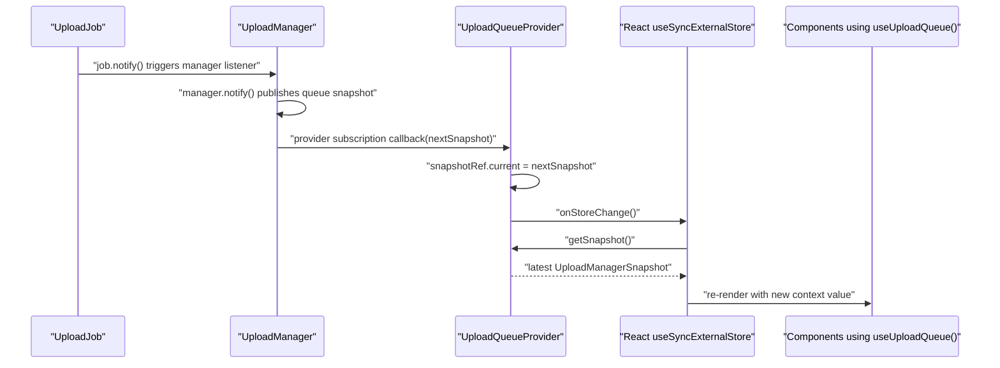

# Upload Queue Architecture

## Purpose

This document explains the custom upload queue architecture used by SecureVault's file upload system, especially the listener chain between:

- `UploadJob`
- `UploadManager`
- `UploadQueueProvider`
- React components using `useUploadQueue()`

The goal is to keep **one central upload queue** for the whole app while still letting many React components render and control that queue safely.

## Core Rule

`UploadManager` is the **single source of truth** for upload queue state.

That means:

- React does **not** own upload state
- upload cards do **not** start their own upload loops
- the provider does **not** implement queue logic
- components only **read snapshots** and **dispatch actions**

## Ownership Model

### `UploadJob`

Owns the lifecycle of **one file upload**.

Examples:

- init upload
- fetch server status
- upload chunks
- complete upload
- pause after current chunk
- cancel after current chunk
- retry failed chunk uploads

Each `UploadJob` has its own `notify()` method. When its internal state changes, it informs its listeners.

### `UploadManager`

Owns the lifecycle of the **whole upload queue**.

Examples:

- store all jobs
- enforce global file-level concurrency
- start queued jobs when slots are available
- forward pause/resume/cancel/remove commands to the correct job
- publish the latest queue snapshot to subscribers

The manager listens to each job. When a job changes, the manager republishes the new queue snapshot.

### `UploadQueueProvider`

Acts as the **React adapter** for the manager.

It does not manage uploads itself. It only:

- gets the singleton manager via `UploadManager.getInstance()`
- subscribes to manager updates
- keeps React synced with the latest manager snapshot
- exposes queue actions through context

### `useUploadQueue()`

This is the public React hook for consuming the upload queue.

It gives components:

- `uploads`
- `addFiles`
- `pauseUpload`
- `resumeUpload`
- `cancelUpload`
- `removeUpload`

It does not contain upload business logic. It only reads the provider context.

## Why This Exists

Without this architecture, multiple components could accidentally create multiple queue states.

Bad outcomes would include:

- one component showing `paused` while another shows `uploading`
- duplicate scheduling logic inside UI components
- multiple upload loops for the same file
- queue state being lost when one component unmounts

This design avoids that by making React a **consumer of queue state**, not the owner of queue state.

## Notification Chain

The upload queue relies on a layered listener chain.

When one job changes, the update moves upward through each layer until React re-renders.

## Detailed Flow

### 1. Job state changes

An `UploadJob` changes state.

Examples:

- progress increases after a chunk upload
- status changes to `pausing`
- status changes to `paused`
- status changes to `success`
- status changes to `failed`

The job then calls its internal `notify()`.

### 2. Manager hears the job update

`UploadManager` subscribes to every job it creates.

When a job notifies, the manager callback runs and:

- publishes a new queue snapshot with `manager.notify()`
- runs `pumpQueue()` so scheduling can continue if capacity changed

This is the bridge from **single-file state** to **global queue state**.

### 3. Provider hears the manager update

`UploadQueueProvider` subscribes to the manager once.

When the manager publishes a new snapshot:

- the provider receives `nextSnapshot`
- it stores that snapshot in `snapshotRef.current`
- it calls `onStoreChange()`

Important:

- the provider is the thing subscribed to `UploadManager`
- child components are **not** directly subscribed to `UploadManager`

This prevents one manager subscription per upload card.

### 4. React hears the store update

`onStoreChange()` is the callback provided by React's `useSyncExternalStore`.

Conceptually it means:

> "The external store changed. React should read the latest snapshot again."

After `onStoreChange()` runs, React calls `getSnapshot()` and compares values to decide whether consumers should update.

### 5. Components re-render from context

Once the provider has the latest snapshot, it publishes a new context value.

Components using `useUploadQueue()` then re-render with:

- the latest `uploads`
- the same central action methods

They do not run upload logic themselves.

## Why `useSyncExternalStore` Is Used

`UploadManager` is an **external store** because its state lives outside React.

`useSyncExternalStore` is the correct React primitive for this case because it gives React a safe way to:

- subscribe to external changes
- read the current snapshot
- avoid missing updates between render and subscription setup

This is better than trying to mirror manager state with ad hoc `useEffect` and `useState` wiring.

## Why `snapshotRef` Exists

The provider keeps the latest manager snapshot in a ref.

This helps for two reasons:

- it gives `getSnapshot()` a stable current value to return
- it reduces the chance of missing an update that lands between render-time reads and subscription setup

So the ref acts as the provider's cached view of the manager's current state.

## What Components Should And Should Not Do

### Components should

- call `useUploadQueue()`
- render `uploads`
- dispatch user actions like pause, resume, cancel, and remove

### Components should not

- instantiate `UploadManager`
- keep a second queue in `useState`
- run scheduling logic
- maintain their own upload loop
- guess whether a removal should succeed

If the manager rejects a change, the UI should simply reflect the manager snapshot.

## Example Mental Model

Think of the system as layers:

- `UploadJob`: one file
- `UploadManager`: all files
- `UploadQueueProvider`: React bridge
- `useUploadQueue()`: component API
- components: UI only

Or more simply:

- jobs know how to upload
- manager knows how to coordinate
- provider knows how to sync React
- components know how to render and invoke actions

## Invariants

These rules should stay true as the system evolves:

- there is exactly one app-wide `UploadManager`
- React reads queue state from the manager instead of owning it
- `UploadQueueProvider` subscribes once per mounted provider
- `useUploadQueue()` is the only React-facing queue access point
- upload queue ordering comes from the manager snapshot
- queue behavior changes belong in `UploadManager` or `UploadJob`, not in UI components

## Related Files

- <RepoLink path="secure-vault/src/lib/upload/upload-job.ts" />
- <RepoLink path="secure-vault/src/lib/upload/upload-manager.ts" />
- <RepoLink path="secure-vault/src/components/upload/upload-provider.tsx" />
- <RepoLink path="secure-vault/src/hooks/use-upload-queue.ts" />
- <RepoLink path="secure-vault/tests/upload/upload-job.test.ts" />
- <RepoLink path="secure-vault/tests/upload/upload-manager.test.ts" />
- <RepoLink path="secure-vault/tests/upload/upload-provider.test.tsx" />
