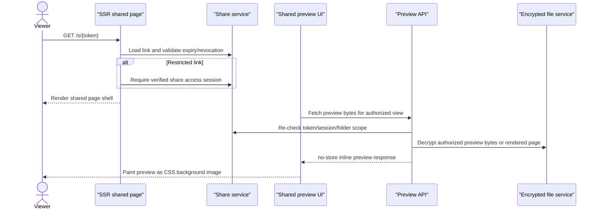

# Shared Preview Protection

SecureVault shared previews are designed around layered deterrence and accountable access.

The core rule is simple: if a browser can show a file preview, a verified viewer can still capture the pixels on screen. SecureVault therefore focuses on controlling who can reach the preview, reducing casual save paths, avoiding unnecessary browser caching, and making restricted access tied to identity.

## Threat Model

Shared preview protection is meant to reduce these risks:

- someone guessing or reusing a shared URL after access should be unavailable
- a casual recipient right-clicking a preview image and saving it
- a recipient dragging the preview image out of the browser
- a recipient using common keyboard shortcuts to open inspection or save source
- copied preview URLs being useful outside the intended session
- public indexing or long-lived browser caching of preview responses

Shared preview protection does not claim to stop these risks completely:

- screenshots or screen recording
- browser menus that open DevTools outside page JavaScript control
- DevTools opened before navigation
- operating-system capture tools
- external network inspection performed by the viewer's own machine
- a determined user copying pixels after they are displayed

That distinction matters. These controls are product security and leak deterrence, not full digital rights management.

## Layered Controls

The current shared-preview model combines several layers.

| Layer | Purpose | Main implementation |
| --- | --- | --- |
| SSR shared route gate | Validates token and restricted-link session before rendering the share page | <RepoLink path="secure-vault/src/app/s/[token]/page.tsx" /> |
| Token and session API checks | Re-validates access before preview, folder browse, PDF manifest, PDF page, and download routes | <RepoLink path="secure-vault/src/app/api/share" kind="tree" /> |
| Email allowlist plus OTP | Ties restricted access to known recipient email addresses | <RepoLink path="secure-vault/src/lib/sharing" kind="tree" /> |
| Share access logging | Records access events for owner visibility and investigation | `share_link_access_logs` |
| Expiry and revocation | Makes links time-bound or owner-revocable | `share_links.expires_at`, `share_links.revoked_at` |
| Download limits | Caps attachment downloads for share links | `share_links.max_downloads` |
| Preview-only PDF rendition | Shared PDF preview serves rendered WebP pages rather than the original PDF | <RepoLink path="secure-vault/src/app/api/share/[token]/pdf-preview" kind="tree" /> |
| Protected preview rendering | Fetches preview bytes and paints them as CSS background images via local `blob:` URLs | <RepoLink path="secure-vault/src/components/share/protected-preview-image.tsx" /> |
| Context menu and shortcut deterrents | Blocks common right-click, save, source, and DevTools shortcuts on shared pages | <RepoLink path="secure-vault/src/components/share/shared-inspection-deterrent.tsx" /> |
| No-store preview headers | Reduces browser caching and indexing of preview bytes | shared preview route handlers |

## Shared Preview Flow

SSR helps because unauthorized users do not receive the shared page state, file metadata, or preview URLs from a static page. API checks still matter because every preview byte request must stand on its own. The server-rendered page is one layer, not the whole security boundary.

## Background Images, Blob URLs, And Data URIs

Native `` previews expose the browser's image-specific context menu, including "Save image as..." in many browsers.

SecureVault avoids that for shared image and PDF page previews by using `ProtectedPreviewImage`:

- the client fetches the protected preview endpoint
- the response body is converted into a local object URL with `URL.createObjectURL`
- the preview is painted as a CSS `background-image`
- the visible element is a normal `div` with `role="img"` and an accessible label
- the object URL is revoked when no longer needed

This is similar in spirit to a Data URI strategy, but `blob:` URLs are better for large previews because they avoid placing large base64 strings into the DOM or CSS text. Both approaches are still visible to a determined viewer through browser tooling or memory inspection. The value is blocking the casual image-element save path.

## Inspection Deterrents

Shared pages mount `SharedInspectionDeterrent`, which blocks:

- right-click context menu
- `F12`
- `Ctrl` or `Cmd` + `Shift` + `I`
- `Ctrl` or `Cmd` + `Shift` + `J`
- `Ctrl` or `Cmd` + `Shift` + `C`
- `Ctrl` or `Cmd` + `U`
- `Ctrl` or `Cmd` + `S`

This is intentionally described as a deterrent. Browser DevTools cannot be truly disabled by a website. Users can still open inspection tools from the browser menu, open DevTools before navigating, use a different client, or capture traffic outside the page.

## Response Headers

Shared preview responses are shaped to reduce reuse and indexing:

- `Cache-Control: private, no-store`
- `Content-Disposition: inline`
- `Cross-Origin-Resource-Policy: same-origin`
- `Referrer-Policy: no-referrer`
- `X-Content-Type-Options: nosniff`
- `X-Robots-Tag: noindex, noarchive`

The shared PDF page route also returns `X-Preview-Cache` as either `hit` or `miss` so engineers can tell whether Redis served a hot page response.

## Restricted Links And Accountability

Email allowlisting is the strongest practical control for the intended sharing model.

Restricted links require recipients to verify an allowed email address through OTP. That changes the risk from "anyone on the internet may access this URL" to "a known recipient can access this preview." It does not prevent misuse by a verified recipient, but it makes access attributable.

The share-link dialog includes a disclaimer near the allowed-email field:

> Restricted links tie preview access to the allowed email addresses. SecureVault reduces casual saving and inspection, but any verified viewer can still capture what appears on their screen.

That language sets the right expectation for owners: allowlisting, expiry, logging, and preview deterrents reduce risk, but they do not make visible content impossible to copy.

## DRM And Watermarking

SecureVault does not currently implement browser DRM.

Real DRM on the open web is primarily built around Encrypted Media Extensions for audio and video. It does not map cleanly to normal image and PDF previews. For documents and images, the more practical next layer is watermarking:

- show the verified email address on the preview
- include a timestamp or share-link identifier
- optionally include session or access-log correlation text
- render the watermark into PDF page derivatives or overlay it in the viewer

Watermarking does not stop capture, but it makes screenshots and copied previews attributable. For an email-allowlisted sharing model, that is usually more valuable than trying to pretend the browser can be made impossible to inspect.

## Engineering Checklist

When changing shared preview behavior, preserve these invariants:

- every preview route must validate the share token before returning bytes
- restricted links must require a valid share access session
- folder shares must validate the requested file is inside the shared folder scope
- browser-facing preview responses must remain `no-store`
- shared PDF page cache lookup must happen after authorization
- preview rendering should avoid native image elements for shared protected content
- UI copy should describe deterrence honestly instead of promising impossible protection
