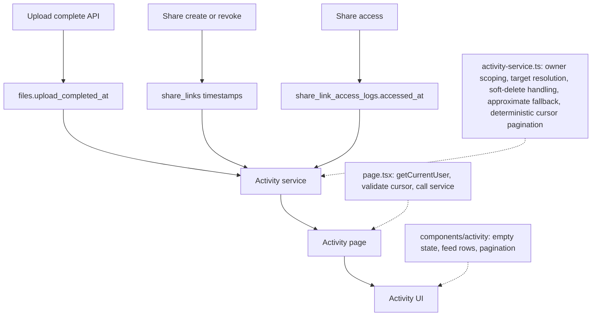
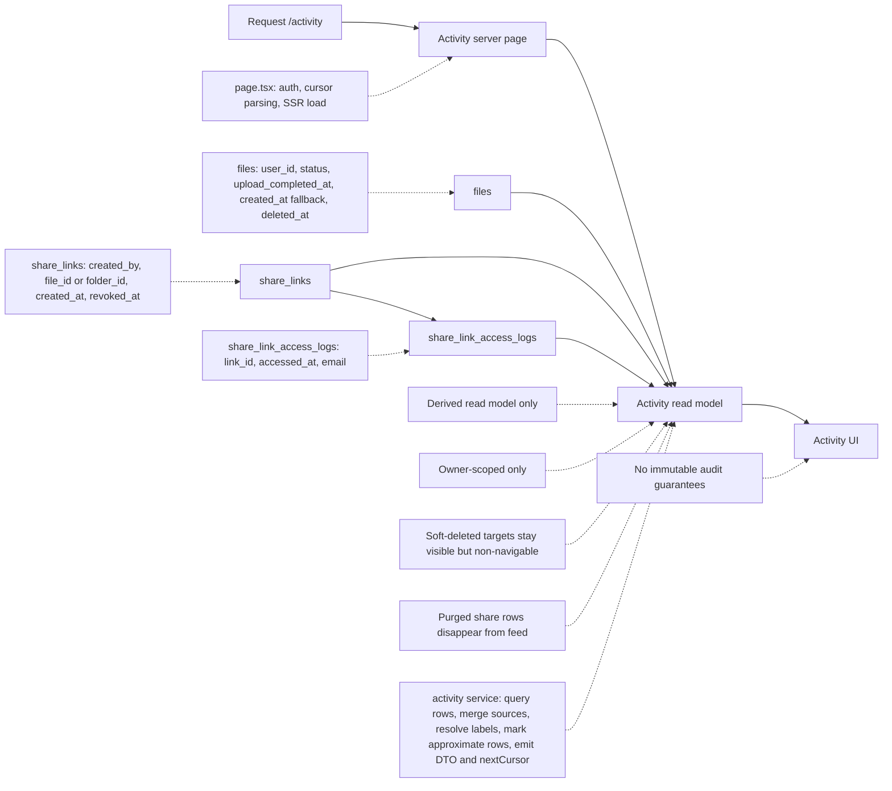

# Phase 13 - Activity Feed / Audit Log UI

> **Objective:** Replace the placeholder `/activity` screen with an owner-scoped, read-only timeline for completed uploads, share creation, share revocation, and share access events.

**Depends on:** Phase 4 (Upload completion), Phase 8 (Link Sharing), Phase 10 (Trash / Soft Delete)  
**Blueprint ref:** Section 16 (Activity / Audit Log UI)

> [!IMPORTANT]
> `/activity` and the `Activity` dashboard nav item already exist in the current codebase. This phase is about wiring real data and replacing placeholder UI, not adding a new route or sidebar entry.

> [!IMPORTANT]
> This phase stays bounded by the current data-retention model. Under the existing trash purge behavior, permanently deleted share links and their access logs are removed from the database, so this feed must not promise immutable long-term audit retention.

---

## Simple Data Flow



## Whole Architecture Diagram



---

## Current Implementation Snapshot

- [x] `secure-vault/src/app/(dashboard)/activity/page.tsx` already exists.
- [x] `secure-vault/src/components/dashboard/dashboard-navigation.ts` already includes `Activity`.
- [x] `secure-vault/src/lib/db/schema/sharing.ts` already defines `share_links` and `share_link_access_logs`.
- [ ] `secure-vault/src/components/activity/activity-page-content.tsx` is still placeholder UI.
- [ ] There is no dedicated activity read model under `secure-vault/src/lib/activity/`.
- [ ] `files.created_at` is upload-init time, not upload-complete time.
- [ ] The current `/files` experience uses client-side folder state, so this phase does not have an existing per-item deep-link contract for activity-row CTAs.

### Codebase Corrections To The Original Draft

- Do not create `src/lib/services/activity-service.ts`. This repo favors feature-focused modules, so activity code should live under `secure-vault/src/lib/activity/`.
- Do not keep a task for adding the Activity nav link. That work is already done.
- Do not model upload events from `files.created_at` alone for new writes. This phase needs an immutable completion timestamp, with `created_at` used only as a documented compatibility/backfill fallback when `upload_completed_at` is still `null`.
- Do not promise deleted-target history after permanent purge unless retention rules are explicitly changed in a different phase.

---

## Architecture Guardrails

- Treat activity as a derived read model, not a new event-write subsystem.
- Do not add an `activity_events` table for this phase.
- Add `files.upload_completed_at` and use it as the canonical timestamp for upload events.
- Backfill `upload_completed_at` for existing `files.status = "ready"` rows from `files.created_at` as the best available approximation.
  Legacy rows must be documented as approximate because exact historical completion timestamps do not exist in the current schema.
- Keep `upload_completed_at` nullable for rollout safety, and add an explicit post-deploy repair step for any `files.status = "ready"` rows that were written between migration and application rollout while the new column was still unset.
- Allow the activity read model to fall back to `files.created_at` only when `files.status = "ready"` and `upload_completed_at` is `null`, and mark those entries as approximate in the DTO so the UI can render truthful copy.
- Add feed-supporting composite indexes with the schema work so owner-scoped newest-first queries do not devolve into scans and large sorts.
  Recommended coverage:
  - `files (user_id, upload_completed_at, id)`
  - `share_links (created_by, created_at, id)`
  - `share_links (created_by, revoked_at, id)`
  - `share_links (created_by, id, file_id, folder_id)`
  - `share_link_access_logs (link_id, accessed_at, id)`
- Define the `share_accessed` query shape explicitly up front.
  For this phase, implement it as an owner-scoped join from `share_links` to `share_link_access_logs`, with the owner filter applied on `share_links.created_by` first and the result merged into the mixed-source feed using the same deterministic cursor ordering as the other sources.
  Do not leave the access query as an unspecified "join later" detail.
  Before implementation, confirm with `EXPLAIN` that the chosen join order uses the owner/join indexes above and does not scan unrelated owners' links.
- Do not add `share_links.target_type` in this phase. Under the current trash-purge implementation, scoped `share_links` rows are deleted before the corresponding file or folder is hard-deleted, so a persisted target-type column would add write/migration cost without improving retained post-purge history.
- Keep the feed bounded by current source-row retention:
  - share-link creation, revocation, and access history disappears once the corresponding `share_links` row is permanently purged
  - this phase does not change trash-purge retention behavior
- Keep all data shaping in a domain service and pass normalized DTOs, including CTA state, into the page component.
- Scope every query to the current signed-in user's owned files, folders, and share links.
- Keep pagination page size server-controlled.
  Use a fixed default page size and clamp any future override to a small safe maximum.
- Use stable newest-first cursor pagination so rows do not reshuffle when timestamps collide.
- Define an explicit total ordering across mixed sources and encode all ordering components in the cursor so merged sources cannot duplicate or skip rows at page boundaries.
  Use a stable source-kind rank owned by this feature, not incidental lexical ordering of enum strings.
  Example: `(occurredAt DESC, sourceKindRank DESC, sourceId DESC)`.
- If the service merges multiple per-source queries in application code, use bounded over-fetch plus refill until the page is full or all sources are exhausted.
  Do not solve mixed-source pagination by loading unbounded history from any source into memory.
- Keep the page server-rendered and drive pagination from `searchParams` unless implementation friction proves a client query is necessary.
- Render timestamps consistently with the existing app formatting utilities.
- Keep activity rows concise: event type, target label, actor, timestamp, and one safe CTA when it is actually navigable.
- Do not invent new per-file or per-folder deep links in this phase. If a row cannot point to an already-supported stable route, return `ctaHref = null`.
- Treat soft-deleted targets as deleted for feed label and CTA purposes even while the underlying `share_links` row still survives.
- Keep the copy honest: this derived feed uses current surviving target labels, so later file/folder renames can change how older events are displayed. Do not position the feature as immutable audit evidence.

---

## Target Design

### Feed Event Types

The activity feed should normalize these event kinds:

- `upload_completed`
- `share_created`
- `share_revoked`
- `share_accessed`

Suggested DTO shape:

```ts
type ActivityEventKind =
  | "upload_completed"
  | "share_created"
  | "share_revoked"
  | "share_accessed";

type ActivityFeedEntry = {
  id: string;
  sourceId: string;
  occurredAt: string;
  occurredAtApproximate: boolean;
  kind: ActivityEventKind;
  actorLabel: string | null;
  targetId: string | null;
  targetType: "file" | "folder" | "unknown";
  targetLabel: string;
  ctaHref: string | null;
  ctaLabel: string | null;
};

type ActivityFeedPage = {
  entries: ActivityFeedEntry[];
  hasMore: boolean;
  nextCursor: string | null;
};
```

Cursor guidance:

- Cursor payload should include `occurredAt`, `sourceKindRank`, and `sourceId`
- Do not use raw enum-string sort order as the persisted cursor contract
- Keep page size internal to the service for this phase; `/activity` only accepts `cursor`

### Data Sources

| Event | Source |
| --- | --- |
| `upload_completed` | `files.upload_completed_at` |
| `share_created` | `share_links.created_at` |
| `share_revoked` | `share_links.revoked_at` |
| `share_accessed` | `share_link_access_logs.accessed_at` |

Compatibility rule:

- For `files.status = "ready"` rows with `upload_completed_at = null`, the read model may temporarily emit `upload_completed` from `files.created_at` with `occurredAtApproximate = true`.
- A post-deploy repair step must backfill those remaining `null` rows so this fallback can be removed or become truly exceptional.

### Deleted Target Behavior

- If the target row still exists but is soft-deleted, render it as deleted and do not expose a navigable CTA.
- If a surviving row is missing enough metadata to determine a safe label, render `Deleted item`.
- Under the current purge implementation, permanently deleting a file or folder also deletes the scoped `share_links` rows first, so deleted-target history does not survive purge in the normal application flow.
- If the share row itself has already been purged by existing trash cleanup, that history is out of scope for this feed and will no longer appear.

---

## Detailed Tasks

### 13.1 - Add schema support for truthful activity timestamps and labels

- [ ] Update `secure-vault/src/lib/db/schema/files.ts`
  - Add nullable `upload_completed_at: timestamp()`
  - Add a composite index that supports owner-scoped newest-first upload activity reads
- [ ] Add a Drizzle migration under `secure-vault/drizzle/`
  - Add the new `upload_completed_at` column
  - Backfill existing `ready` rows from `created_at`
  - Add the new upload activity index
- [ ] Update `secure-vault/src/app/api/upload/complete/service.ts`
  - Set `upload_completed_at = new Date()` when a file transitions to `ready`
  - Keep the timestamp immutable after first completion
  - Preserve existing values on idempotent or repeated completion attempts
- [ ] Update `secure-vault/src/lib/db/schema/sharing.ts`
  - Add owner/timestamp indexes that support share-created and share-revoked activity queries
  - Add an owner/join index that supports owner-scoped share-access reads
  - Add an access-log timestamp index that supports newest-first access history reads per share link
- [ ] Add a Drizzle migration under `secure-vault/drizzle/`
  - Add the new share activity indexes
- [ ] Add an explicit rollout-repair step
  - Provide an idempotent SQL statement or scripted maintenance step that backfills `files.upload_completed_at` for any `ready` rows still left `null` after the new write path has shipped
  - Document how the repair step is executed during rollout and how success is verified

### 13.2 - Introduce a dedicated activity read model

- [ ] Add `secure-vault/src/lib/activity/activity-types.ts`
  - `ActivityEventKind`
  - `ActivityFeedEntry`
  - `ActivityFeedPage`
  - cursor parsing/serialization helpers
  - explicit source-kind rank helpers for deterministic mixed-source ordering
- [ ] Add `secure-vault/src/lib/activity/activity-service.ts`
  - Export a focused read function such as `getActivityFeedForUser({ userId, cursor, pageSize })`
  - Normalize rows from:
    - `files`
    - `share_links`
    - `share_link_access_logs`
  - Scope by current owner only
  - Implement `share_accessed` as the explicit owner-scoped join/query shape defined in the architecture section rather than leaving it implicit
  - Use a fixed default page size and bounded over-fetch/refill strategy if source rows are merged in application code
  - Order newest first with deterministic tie-breaking across mixed sources
  - Use a cursor that includes the full mixed-source ordering key
  - Return `entries`, `hasMore`, and `nextCursor`
- [ ] Keep label and CTA resolution inside the read model
  - file/folder name when target still exists
  - treat soft-deleted targets as deleted and non-navigable
  - return `Deleted item` when the surviving row no longer contains enough metadata for a safer label
  - return `ctaHref` / `ctaLabel` only for routes that already exist in the app today
- [ ] Keep approximation handling inside the read model
  - mark legacy and rollout-fallback upload entries with `occurredAtApproximate = true`
- [ ] Do not introduce direct SQL or row-shaping logic into React components

### 13.3 - Replace the placeholder activity page

- [ ] Update `secure-vault/src/app/(dashboard)/activity/page.tsx`
  - Read pagination cursor from `searchParams`
  - Validate malformed or tampered cursor input safely
  - Load the current user
  - Call the activity service
  - Pass normalized data into the UI component
  - Do not accept arbitrary page-size input from the URL for this phase
- [ ] Replace `secure-vault/src/components/activity/activity-page-content.tsx`
  - Render page header
  - Render empty state for new users / no events
  - Render timeline/feed rows
  - Render pagination controls
  - Render truthful copy for approximate legacy upload entries if any are present
- [ ] Add `secure-vault/src/components/activity/activity-feed-item.tsx` if needed
  - Keep repeated row markup isolated and easy to test
- [ ] Update `secure-vault/src/app/(dashboard)/activity/loading.tsx`
  - Match the final feed layout rather than a generic single-card skeleton

### 13.4 - Keep navigation behavior but verify it does not regress

- [ ] Do not add a new nav item task
- [ ] Keep `secure-vault/src/components/dashboard/dashboard-navigation.ts` unchanged unless a regression is found
- [ ] Ensure the active-state behavior still highlights `Activity` correctly in existing navigation tests

### 13.5 - Cleanup and naming consistency

- [ ] Keep naming consistent across schema, service, DTOs, and UI props
- [ ] Keep pagination logic centralized rather than split across page and component layers
- [ ] Avoid sprinkling fallback-label logic across multiple files
- [ ] Keep cursor validation and serialization centralized rather than duplicating it in page/UI code
- [ ] Keep feature copy aligned with the derived-read-model limitations so the page does not over-promise immutable audit fidelity
- [ ] Confirm the phase note no longer references nonexistent folders or outdated assumptions

---

## Deliverables

| Output | Location |
| --- | --- |
| Upload completion timestamp schema + backfill | `secure-vault/src/lib/db/schema/files.ts`, `secure-vault/drizzle/` |
| Share activity indexes | `secure-vault/src/lib/db/schema/sharing.ts`, `secure-vault/drizzle/` |
| Upload completion write-path update | `secure-vault/src/app/api/upload/complete/service.ts` |
| Rollout repair step for late-null upload timestamps | `secure-vault/drizzle/` or deployment runbook for this phase |
| Activity DTOs and read model | `secure-vault/src/lib/activity/activity-types.ts`, `secure-vault/src/lib/activity/activity-service.ts` |
| Activity page wiring | `secure-vault/src/app/(dashboard)/activity/page.tsx` |
| Activity feed UI | `secure-vault/src/components/activity/activity-page-content.tsx`, optional `activity-feed-item.tsx` |
| Activity loading state | `secure-vault/src/app/(dashboard)/activity/loading.tsx` |
| Automated coverage | `secure-vault/tests/activity/`, `secure-vault/tests/e2e/activity.spec.ts`, and updated upload/share/trash/dashboard tests |

---

## Recommended Implementation Order

1. Add `upload_completed_at` plus the activity-supporting share indexes in schema and migrations.
2. Update the upload-complete write path to persist `upload_completed_at`.
3. Ship or document the post-deploy repair step for any `ready` rows that still have `upload_completed_at = null`.
4. Build `secure-vault/src/lib/activity/activity-types.ts`.
5. Build `secure-vault/src/lib/activity/activity-service.ts`.
6. Wire `secure-vault/src/app/(dashboard)/activity/page.tsx`.
7. Replace the placeholder activity UI and loading state.
8. Add unit and integration coverage.
9. Add Playwright coverage and perform final manual verification.

---

## Testing

### Run Commands

```bash
npx vitest run tests/activity tests/upload tests/sharing tests/dashboard
npx playwright test tests/e2e/activity.spec.ts tests/e2e/upload-smoke.spec.ts tests/e2e/share-owner-management.spec.ts tests/e2e/share-access-logging.spec.ts tests/e2e/share-folder.spec.ts tests/e2e/trash.spec.ts
```

### Unit Tests

| Test file | Coverage |
| --- | --- |
| `tests/activity/activity-entry-mapper.test.ts` | event-kind mapping, actor labels, target labels, deleted-item fallback, identical-timestamp tie cases, CTA derivation |
| `tests/activity/activity-cursor.test.ts` | cursor parsing/serialization, malformed cursor handling, newest-first stability, deterministic pagination boundaries |
| `tests/activity/activity-page-content.test.tsx` | empty state, approximate-entry messaging, non-navigable rows, pagination controls |
| `tests/activity/activity-page.test.tsx` | server-page cursor handling, null-user handling, safe fallback to page-one input, page-to-service wiring |

Required unit assertions:

- `upload_completed` rows use `upload_completed_at`
- `uploading` / `failed` files and `ready` rows missing all timestamp fallbacks do not appear in the feed
- `share_created`, `share_revoked`, and `share_accessed` map to the right kinds
- anonymous/public access renders without an email actor
- soft-deleted targets map to deleted labels and non-navigable CTA state
- surviving rows with missing target metadata fall back to `Deleted item`
- malformed or tampered cursors are rejected or treated safely as page-one input
- mixed-source rows with identical timestamps follow the explicit source-kind rank rather than incidental string ordering
- rollout/legacy upload fallbacks are marked approximate in the DTO

### Integration Tests

| Test file | Coverage |
| --- | --- |
| `tests/activity/activity-service.test.ts` | owner scoping, mixed event sources, pagination, label resolution, soft-deleted target behavior, approximate upload fallback, empty state data |
| `tests/upload/complete-service.test.ts` | `upload_completed_at` is written when status becomes `ready` and remains stable afterward |
| `tests/activity/activity-rollout-repair.test.ts` or migration smoke coverage | repair-step eligibility, idempotency, and protection of already-set timestamps |
| `tests/dashboard/dashboard-navigation-panel.test.tsx` | Activity nav still renders and active-state behavior does not regress if coverage is missing today |

Required integration assertions:

- feed never returns another user's events
- share-access events only appear for links owned by the current user
- `share_accessed` uses the documented owner-scoped query shape and is validated against an `EXPLAIN` plan during implementation review
- legacy backfilled upload rows still appear in the feed
- post-migration rollout rows with `upload_completed_at = null` still appear as approximate upload events until the repair step runs
- rollout repair backfills only `ready` rows with `upload_completed_at = null`
- rollout repair is idempotent and does not overwrite an existing `upload_completed_at`
- soft-deleted targets render deleted labels and do not expose active navigation CTAs
- rows only return CTA data for routes that actually exist
- mixed-source events with identical timestamps paginate without duplicates or skipped rows
- bounded over-fetch/refill logic still returns a full page when one source dominates the top of the feed
- events disappear after permanent purge under current retention rules only because the source rows are removed
- empty result sets are returned cleanly

### End-to-End Tests

Add `secure-vault/tests/e2e/activity.spec.ts`.

Recommended scenarios:

1. **New user empty state**
   - Sign up a fresh user
   - Open `/activity`
   - Verify the empty state renders without errors

2. **Pagination**
   - Generate enough events to exceed one page
   - Verify older entries load through the page controls in a stable order

3. **Soft-deleted target remains readable but non-navigable**
   - Create a share for a file or folder
   - Soft-delete the target without permanently purging it
   - Verify the feed shows a deleted label and does not expose an active target CTA

4. **Activity page tolerates malformed cursor input**
   - Open `/activity?cursor=not-a-valid-cursor`
   - Verify the page renders safely without a server error

Reuse existing E2E flows instead of duplicating them:

- extend upload E2E coverage to assert that a completed upload appears in `/activity`
- extend share-owner-management coverage to assert share-create and share-revoke activity rows
- extend share-access-logging coverage to assert restricted/public access rows in `/activity`
- extend folder-share coverage to assert folder-target labeling in `/activity`
- extend trash coverage to assert soft-deleted targets remain visible but non-navigable until purge

### Manual Verification

- [ ] Open `/activity` with a brand-new account and confirm the empty state is truthful and polished
- [ ] Upload a file and confirm the feed shows a completed-upload event
- [ ] Confirm any rollout/legacy upload entry copy is clearly marked approximate if such a row is seeded locally
- [ ] Create and revoke a share link and confirm both events appear in order
- [ ] Trigger a share access from another browser session and confirm the owner sees the event
- [ ] Verify soft-deleted targets render as deleted and do not expose navigable CTAs
- [ ] Open `/activity` with an invalid `cursor` query string and confirm the page fails safely
- [ ] Inspect the `share_accessed` query with `EXPLAIN` and confirm the owner filter/join indexes are actually used
- [ ] Run the rollout repair step against seeded `ready` rows with `upload_completed_at = null` and verify it is idempotent
- [ ] Confirm mobile and desktop layouts both read clearly inside the existing dashboard shell
- [ ] Confirm the Activity nav item remains highlighted on `/activity`

---

## Definition of Done

- `/activity` no longer shows placeholder content
- upload events use a truthful completion timestamp with a documented legacy backfill strategy
- rollout-safe handling exists for `ready` rows that temporarily miss `upload_completed_at` during deployment
- feed queries are backed by explicit indexes for owner-scoped newest-first reads
- share and access rows label file vs folder targets correctly while their source rows survive
- soft-deleted targets are rendered safely as deleted and non-navigable
- the plan no longer references nonexistent folders or already-finished nav work
- unit, integration, and e2e coverage exist for core flows and key edge cases
- retention and derived-read-model limits are documented clearly so the feature does not over-promise audit durability or immutable historical naming
